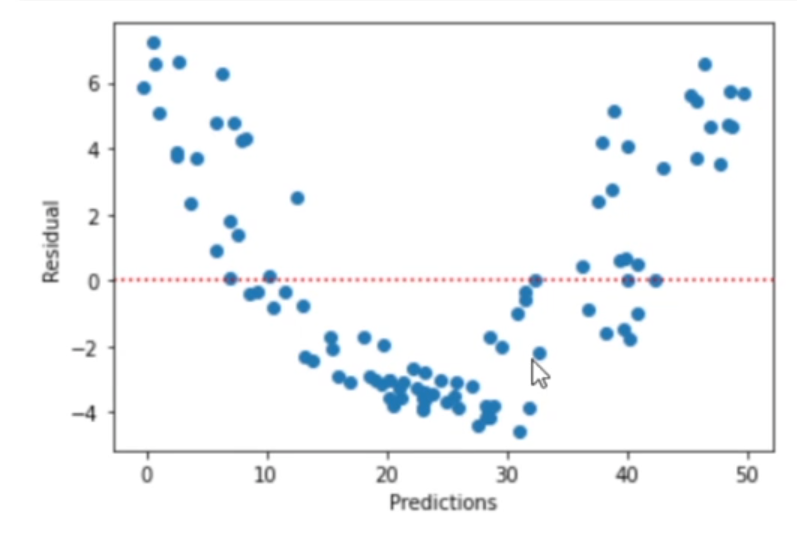
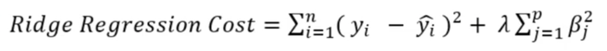
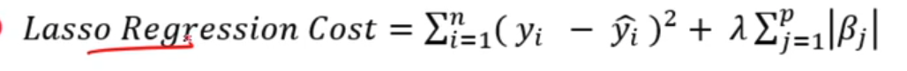
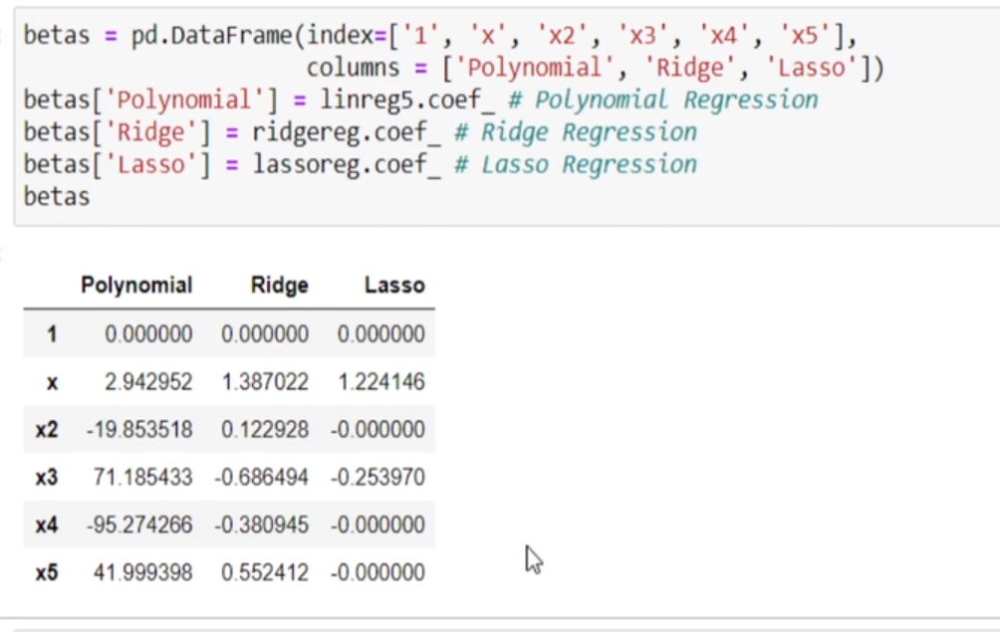

# Advanced Regression

The linear regression framework comprises certain key assumptions:

1. There is a linear relationship between X and Y
2. Error terms are distributed normally with mean equal to 0 (not X, Y)
3. Error terms are independent of each other
4. Error terms have constant variance (homoscedasticity)

We basically use the following plots, which help us assess the above assumptions qualitatively:

* **Residual versus prediction plot**: This plot helps us detect nonlinearity, unequal error variances and outliers.
* **Histogram of error terms**: This plot helps detect non-normality of the error values.

## Handling Nonlinear data

* For Simple Linear Regression
  * Plot the independent variable against the dependent variable to check for nonlinear patterns.
* For Multiple Linear Regression, since there are multiple predictors, we, instead, plot the residuals versus the predicted values, **^**y**i**. Ideally, the residual plot will show no observable pattern. In case a pattern is observed, it may indicate a problem with some aspect of the linear model. Apart from that:
  * Residuals should be randomly scattered around 0.
  * The spread of the residuals should be constant.
  * There should be no outliers in the data

If nonlinearity is present, then we may need to plot each predictor against the residuals to identify which predictor is nonlinear.

There are three methods to handle nonlinear data:

* Polynomial regression
* Data transformation
* Nonlinear regression

### Polynomial Regression

The kth-order polynomial model in one variable is given by:

y=β0 + β1x + β2x^2 + β3x^3 +....++βk**x^k + ϵ

### Data Transformation

For a predictor x, these transformations can be log(x), sqrt(x), exp(x), etc., in the regression model.

[https://www.mathsisfun.com/sets/functions-common.html](https://www.mathsisfun.com/sets/functions-common.html)

It's a trial and error procedure

---

**WHEN TO DO TRANSFORMATION?**

* If there is a **non-linear** trend in the data, the **first thing** to do is to transform the predictor values.
* When the problem is the **non-normality** of error terms and/or **unequal variances** are the problems, then consider transforming the  **response variable** ; this can also help with  **non-linearity** .
* When the regression function is **not linear** and the error terms are **not normal** and have  **unequal variances** , then transform both the response and the predictor.
* In short, generally:
  * **Transforming the y values** helps in handling issues with the error terms and may help with the non-linearity.
  * **Transforming the x values** primarily corrects the non-linearity.

### Non linear regression

* Non-linear regression is a method to model a non-linear relationship between the dependent variable and a set of independent variables.
* For a model to be considered non-linear, predicted values must be a non-linear function of beta parameters and not necessarily of the predictors.
* In non-linear regression, a model is non-linear in parameters.
* The Ordinary Least Squares method can no longer be used to fit the data.

## Linear Regression Pitfalls

When we fit a linear regression model to a particular data set, many problems may arise. Most common among these are the following:

1. Non-constant variance
2. Autocorrelation and time series issue
3. Multicollinearity
4. Overfitting
5. Extrapolation

## Regularization

When a model performs really well on the data that is used to train it, but does not perform well with unseen data, we know we have a problem: overfitting. Such a model will perform very well with training data and, hence, will have very low bias; but since it does not perform well with unseen data, it will show high variance.

One way in which we can manage overfitting is through Regularization

(https://learn.upgrad.com/course/5800/segment/54463/324123/981324/4902231)

When we use regularization, we add a penalty term to the model’s cost function.

Here, the cost function would be  **Cost = RSS + Penalty** .

Adding this penalty term in the cost function helps suppress or shrink the magnitude of the model coefficients towards 0. This discourages the creation of a more complex model, thereby preventing the risk of overfitting.

Imp: Trade bias for a significant reduction in variance

### Ridge Regularization

In OLS, we get the best coefficients by minimising the residual sum of squares (RSS). Similarly, with Ridge regression also, we estimate the model coefficients, but by minimising a different cost function. This cost function adds a penalty term to the RSS

The penalty term is lambda multiplied by the sum of squared model coefficients.

* Ridge regression has a particular advantage over OLS when the OLS estimates have high variance, i.e., when they overfit. Regularization can significantly reduce model variance while not increasing bias much.
* The tuning parameter lambda helps us determine how much we wish to regularize the model. The higher the value of lambda, the lower the value of the model coefficients, and more is the regularization.
* Choosing the right lambda is crucial so as to reduce only the variance in the model, without compromising much on identifying the underlying patterns, i.e., the bias.
* It is important to standardise the data when working with Ridge regression.

### Lasso Regularization

* Like Ridge regression, the Lasso shrinks the coefficient estimates towards zero
* Penalty in Lasso forces some of the co-efficient estimates to be exactly equal to zero - the lasso performs variable selection
* Models generated from the Lasso are generally easier to interpret than those produced by Ridge regression
* Here, selecting a good value of lambda is crucial
* As lambda increases, the variance decreases and bias increases

**Why Does β** **Decrease?**

As increases, the algorithm finds a balance between minimizing the residuals and minimizing the size of the coefficients (to satisfy the penalty term). The optimization process adjusts the coefficients to reduce the penalty. Since the L1 penalty term involves the sum of absolute values of the coefficients, it encourages shrinking the coefficients because:

* If a coefficient is small or zero, it reduces the penalty term and hence minimizes the total loss.
* Large values of *β* contribute more to the penalty term, increasing the overall loss. The algorithm therefore "shrinks" the coefficients to reduce this cost.

