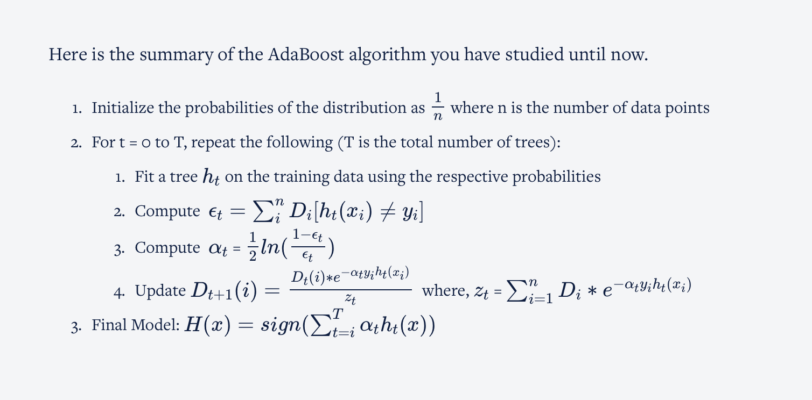

# Boosting

This technique combines individual weaker models into a strong learner by creating sequential models such that the final model has a higher accuracy than the individual models.

## Weak Learners

* A weak model is a model which is atleast better than doing a random guess
* Any model can be a weak learner - linear regression, decision tree
* Decision Stump is a very shallow decision tree of depth 1
* A weak model/learner is not capable of overfitting

Weak learners are combined sequentially such that each subsequent model corrects the mistakes of the previous model, resulting in a strong overall model that gives good predictions.

## Adaboosting

### Steps of Adaboot algorithm

* AdaBoost starts with a uniform distribution of weights over training examples, i.e., it gives equal weights to all its observations. These weights tell the importance of each datapoint being considered.
* We start with a single weak learner to make the initial predictions h1(x)
* Once the initial predictions are made, patterns which were not captured by the previous weak learner are taken care of by the next weak learner by giving more weightage to the misclassified datapoints.
* Apart from giving weightage to each observation, the model also gives weightage to each weak learner. More the error in the weak learner, lesser is the weightage given to it. This helps when the ensembled model makes final predictions.
* After getting the two weights for the observations and the individual weak learners, the next weak learner in the sequence trains on the resampled data (data sampled according to the weights) to make the next prediction.
* The model will iteratively continue the steps mentioned above for a pre-specified number of weak learners.
* In the end, you need to take a weighted sum of the predictions from all these weak learners to get an overall strong learner.

### Adaboost mathematical steps

In AdaBoost, we start with a base model with equal weights given to every observation. In the next step, the observations which are incorrectly classified will be given a higher weight so that when a new weak learner is trained, it will give more attention to these misclassified observations.

In the end, you get a series of models that have a different say according to the predictions each weak model has made. If the model performs poorly and makes many incorrect predictions, it is given less importance, whereas if the model performs well and makes correct predictions most of the time, it is given more importance in the overall model.

The say/importance each weak learner — in our case the decision tree stump — has in the final classification depends on the total error it made.

α = 0.5 ln( (1 − Total error)/Total error )

You can see the relation of  **α(alpha)** **&** error in the following graph

.png)

The value of the error rate lies between 0 and 1. So, let’s see how alpha and error is related.

* When the base model performs with less error overall, then, as you can see in the plot above, the α is a large positive value, which means that the weak learner will have a high say in the final model.
* If the error is 0.5, it means that it is not sure of the decision, then the α = 0, i.e., the weak learner will have no say or significance in the final model.
* If the model produces large errors (i.e., close to 1), then α is a large negative value, meaning that the predictions it makes are incorrect most of the time. Hence, this weak learner will have a very low say in the final model.

After calculating the say/importance of each weak learner, you must determine the new weights of each observation present in the training data set. Use the following formula to compute the new weight for each observation:

new sample weight for the **incorrectly classified observation = original sample weight e^α**

new sample weight for the **correctly classified observation = original sample weight e^-α**

After calculating, we normalise these values to proceed further using the following formula:

**Normalised weights** **=**p**(**x**i**)/**∑**n**i **p**(**x**i**) , where p(xi) is the weight of each observation.

The samples which the previous stump incorrectly classified will be given higher weights and the ones which the previous stump classified correctly will be given lower weights.

### Youtube link

https://www.youtube.com/watch?v=LsK-xG1cLYA
