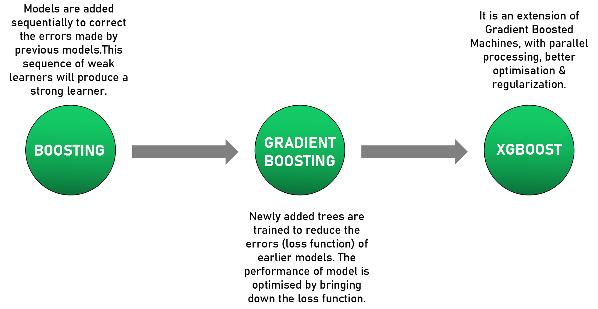

## Introduction

Gradient Boosting, like AdaBoost, trains many models in a gradual, additive and sequential manner. However, the major difference between the two is how they identify and handle the shortcomings of weak learners. In AdaBoost, more weight is given to the datapoints which are misclassified/wrongly predicted earlier. Gradient Boosting performs the same by using gradients in the loss function.

### How a GBM regressor learns:

* Build the first weak learner using a sample from the training data; you can consider a decision tree as the weak learner or the base model. It may not necessarily be a stump, can grow a bigger tree but will still be weak, i.e., still not be fully grown.
* Then, predictions are made on the training data using the decision tree which was just built.
* The** ****negative**  **gradient** , in our case the residuals, are computed and these** residuals are the new response or target values for the next weak learner.**
* A new weak learner is built with the residuals as the target values and a sample of observations from the original training data.
* Add the predictions obtained from the current weak learner to the predictions obtained from all the previous weak learners. The predictions obtained at each step are multiplied by the learning rate so that no single model makes a huge contribution to the ensemble thereby avoiding overfitting. Essentially, with the addition of each weak learner, the model takes a very small step in the right direction.
* The next weak learner fits on the residuals obtained till now and these steps are repeated, either for a pre-specified number of weak learners or if the model starts overfitting, i.e., it starts to capture the niche patterns of the training data.
* GBM makes the final prediction by simply adding up the predictions from all the weak learners (multiplied by the learning rate).

### How a GBM learns for a classification problem:

* Build the first weak learner using a sample from the training data.  The initial prediction for every individual sample will be** ** **log(odds)** (where odds = number of positive samples/number of negative samples).
* Convert the result obtained from log(odds) to a probabilty value by using the sigmoid  function to transform it.**P**r**o**b**a**b**i**l**i**t**y**=**e**l**o**g**(**o**d**d**s**)/**1**+**e**l**o**g**(**o**d**d**s**)
* Once the predictions are made, calculate the residuals, which will be the new response or target values for the next weak learner.
* A new weak learner is built with the residuals as the target values and a sample of observations from the original training data.
* Calculate the output of each leaf of the current weak learner to find the new predictions.

* The final prediction is adding the current predictions to the predictions obtained from all the previous weak learners. The predictions obtained at each step are multiplied by the learning rate so that no single model makes a huge contribution to the ensemble thereby avoiding overfitting. Essentially, with the addition of each weak learner, the model takes a very small step in the right direction.
* The next weak learner fits on the residuals obtained till now and these steps are repeated, either for a prespecified number of weak learners or if the model starts overfitting, i.e., it starts to capture the niche patterns of the training data.
* GBM makes the final prediction by simply adding up the predictions from all the weak learners (multiplied by the learning rate).

## XG Boost

### Why is XGBoost so good?

1. **Parallel Computing:** When you run XGBoost, by default it would use all the cores of your laptop/machine enabling its capacity to do parallel computation.
2. **Tree pruning using depth first approach:** XGBoost uses ‘max_depth’ parameter as specified instead of criterion first, and starts pruning trees backward.
3. **Missing Values:** XGBoost is designed to handle missing values internally. The missing values are treated in such a manner that any trend in missing values (if it exists)  is captured by the model.
4. **Regularization:** The biggest advantage of XGBoost is that it uses regularisation in its objective function which helps to controls the overfitting and simplicity of the model,  leading to better performance.

### how an XGBoost learns:

* Build the first weak learner which performs the initial prediction on the given dataset. The initial prediction will be 0.5 for both regression & classification tasks.
* The residuals are computed and they will be the new response or target values for the next weak learner.
* A new weak learner is built with the residuals as the target values and a sample of observations from the original training data.
* The new weak learner is created by calculating the** ****similarity score and gain** for all the constructed trees.** ****The final tree is the one which has the optimal split i.e highest gain. ** The various trees are constructed by splitting the data into two partitions of various possible splits or thresholds. This threshold for root is calculated by taking an average of two close points among the split and the residuals go to the respective leaf.

**Gain = Similarity score(Left leaf) + Similarity score(right leaf) – Similarity score(root node)**

* Using the tree with the highest gain, each node will split into further sub-nodes.
  The nodes will stop splitting when it has only 1 residual left or based on the user-defined min number of sample data in each node, max iterations or tree depth. Tree pruning prevents overfitting with the help of** ****threshold parameter γ.** A branch containing the terminal node is pruned when the** ** **gain < γ (or gain-γ = negative)** .
* Once the tree is built, calculate the output of each leaf to find the new prediction.

* Add the predictions obtained from the current weak learner to the predictions obtained from all the previous weak learners. The predictions obtained at each step are multiplied by the learning rate so that no single model makes a huge contribution to the ensemble thereby avoiding overfitting. Essentially, with the addition of each weak learner, the model takes a very small step in the right direction.
* The next weak learner fits on the residuals obtained till now and these steps are repeated, either for a prespecified number of weak learners or if the model starts overfitting, i.e., it starts to capture the niche patterns of the training data.

#### **Youtube link**

https://www.youtube.com/watch?v=OtD8wVaFm6E
