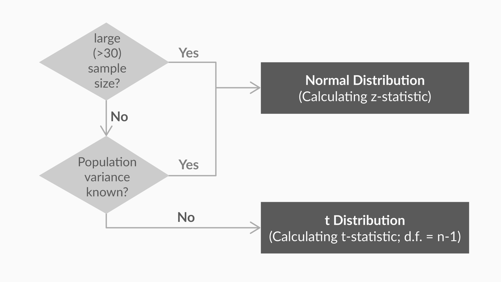

##### Hypothesis Testing

* Null hypothesis
* Alternate hypothesis

##### Types of tests

* Two-tailed tests
* One-tailed tests

##### Critical Value Method

Zc - Use significance level on z-index table, if single tailed then find directly or if 2 tailed then significance_level/2 and then find on z-index table

μ ± Zc x (σ/sqrt(N))

##### p-value method

After formulating the null and alternate hypotheses, the steps to follow in order to **make a decision** using the **p-value method** are as follows:

1. Calculate the value of z-score for the sample mean point on the distribution
2. Calculate the p-value from the cumulative probability for the given z-score using the z-table
3. Make a decision on the basis of the p-value (multiply it by 2 for a two-tailed test) with respect to the given value of α (significance value); i.e if p-value is less than α, you can reject the null hypothesis

**z**= (**x**ˉ-**μ)/(σ/sqrt(n))**


##### Types of Errors

There are two types of errors that can result during the hypothesis testing process — type-I error and type-II error.

A **type I-error** represented by α occurs when you reject a true null hypothesis.

A **type-II error** represented by β occurs when you fail to reject a false null hypothesis.


##### t-distribution

In cases, where you don't know the population standard deviation you use **t-test** instead of **z-test**(critical value method and p-value method)




How to?

1. **Use the t-table** to find the value of Zc (Degrees of freedom (df) = n - 1; where n is the sample size which is less than 30)

##### 2-sample mean test

Use Add-Ins in excel to add "Data Analysis Toolpak"

##### 2-sample proportion test

**Two-sample proportion test** is used when your sample observations are categorical, with two categories. It could be True/False, 1/0, Yes/No, Male/Female, Success/Failure etc.

You need to use XLSTAT as a plugin


# Hypothesis testing in Python

You can easily do hypothesis testing in Python by using **stats** from **Scipy** library.

## 1-sample t-test: testing the value of a population mean

To test, if the population mean of data is likely to be equal to a given value

```
scipy.stats.ttest_1samp()
```


```
stats.ttest_1samp(data['column'], x)
#where x is the mean value you want to test
```

## 2-sample t-test: testing for difference across populations

```
scipy.stats.ttest_ind()

stats.ttest_ind(column_1,column_2) 
```


## Paired tests: repeated measurements on the same individuals

```
stats.ttest_rel()  

stats.ttest_rel(column_1,column_2)  
```
