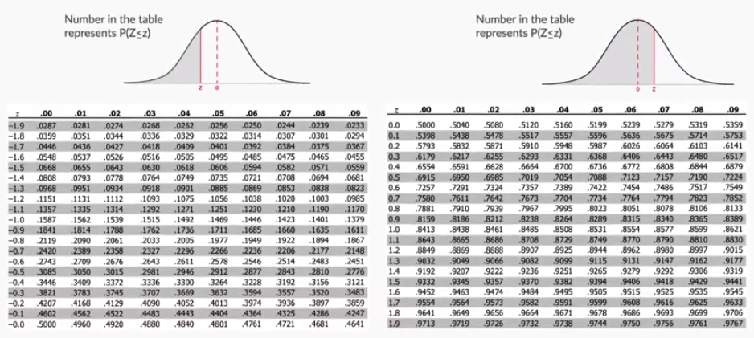

##### **Probabiliity** = No. of favourable outcomes/Total outomes

A dice thrown probability of 3: 1/6

##### Addition rule:

1. When mutually exclusive: P(A) + P(B)

   Eg: 2 or 5 when a dice rolled: 1/6 + 1/6 = 1/3

2) When not mutually exclusive: P(A) + P(B) - P(A AND B)

##### Multiplication rule:

1) Two events, A and B, are independent if the fact that A occurs does not affect the probability of B occurring.

   When two events, A and B, are independent, the probability of both occurring is:

   P(A and B) = P(A) · P(B)
2) Two events are dependent if the outcome or occurrence of the first affects
   the outcome or occurrence of the second so that the probability is changed.

   When two events, A and B, are dependent, the probability of both occurring is:

   P(A and B)  =  P(A) · P(B|A)

   Eg:
   Mr. Parietti needs two students to help him with a science demonstration for his class of 18 girls and 12 boys. He randomly 		chooses one student who comes to the front of the room. He then chooses a second student from those still seated. What is the probability that both students chosen are girls?

   Probabilities P(Girl 1 and Girl 2) = P(Girl 1) and P(Girl 2|Girl 1)

   = 	18/30* 	17/29 = 51/145

##### Combinatrics

**𝐶**(**𝑛**,**𝑟**)**=**𝑛**!/**(**𝑟**!**(**𝑛**−**𝑟**)**!**),** For n ≥ r ≥ 0.

**Random variable X** basically converts outcomes of experiments to something measurable. Eg: Converting Yes/No into 1/0 to help with quanitification.

**Probability distribution** is ANY form of representation that tells us the probability for all possible values of X.

The **expected value** for a variable X is the value of X we would “expect” to get after performing the experiment once. It is also called the  **expectation** ,  **average** , and **mean value**

##### Binomial Probability Distribution

Say you have 4 red balls and 1 blue ball in bag, probability of getting 3 red ball in 4 trials is:

(4/5 * 4/5 * 4/5 * 1/5) + (4/5 * 1/5 * 4/5 * 4/5) + (4/5 * 4/5 * 1/5 * 4/5) + (1/5 * 4/5 * 4/5 * 4/5)

=  4 * (4/5 * 4/5 * 4/5 * 1/5)

= 4 * (4/5 ^ 3) * (1/5 ^ 1)

Similary, you probability of getting r red balls in n trials is, say p is the probability of getting a red ball:

= **nCr * (p ^ r) * ((1-p)^(n-r))**

Where **n** is  **no. of trials** , **p** is **probability of success** and **r** is  **no. of successes after n trials** .

However, there are some **conditions** that need to be followed in order for us to be able to apply the formula.

1. **Total number** of trials is **fixed** at n
2. Each trial is  **binary** , i.e., has **only two possible outcomes** - success or failure
3. **Probability of success** is **same** in all trials, denoted by p

##### The  "**cumulative probability" of X** , denoted by  **F(x)** , is defined as **the probability of the variable being less than or equal to x**

# Probability Density Functions

**CDF** , or a  **cumulative distribution function** , is a distribution which plots the cumulative probability of X against X.

**PDF** , or  **Probability Density Function** , however, is a function in which the area under the curve, gives you the cumulative probability.

**IMP**: CDF of a continuous variable is a line graph wheras of a discrete variable is a bar chart

**for a  **continuous random variable** , the **probability of getting an exact value is** very low, almost  **zero** .**

##### Normal Distribution (Bell Curve)

All data that is normally distributed follows the  **1-2-3 rule** . This rule states that there is a -

1. **68%** probability of the variable lying **within 1 standard deviation** of the mean
2. **95%** probability of the variable lying **within 2 standard deviations** of the mean
3. **99.7%** probability of the variable lying **within 3 standard deviations** of the mean

**Standardized Normal Distribution (Z) = (X-mean)/standard_deviation**

# Central Limit Theorem

##### Sampling Terminologies and Formulae

##### Sampling Distributions

The sampling distribution, specifically the sampling distribution of the sample means, is a probability density function for the sample means of a population.

The **sampling distribution’s mean is denoted by **μ**¯**X**,** as it is the mean of the sampling means.

There are two important properties for a sampling distribution of the mean:

1. **Sampling distribution’s mean** (**μ**¯**X**) =  Population mean  (μ)
2. Sampling distribution’s standard deviation ( **Standard error** ) = **σ/**√**n**, where σ is the population’s standard deviation and n is the sample size

##### Theorem

The central limit theorem says that, for any kind of data, provided a high number of samples has been taken, the following properties hold true:

1. **Sampling "distribution’s" mean** (**μ**¯**X**) = **Population mean** (μ)
2. Sampling distribution’s standard deviation ( **Standard error** ) = **σ/**√**n**
3. **For n > 30** , the sampling distribution becomes a **normal distribution**

##### Estimating Mean Using CLT

let’s say you have a sample with sample size n, mean  and standard deviation S. Now, the  **y% confidence interval** (i.e. the confidence interval corresponding to y% confidence level) for  would be given by the range:

Confidence interval = ,

where,  **Z* is the Z-score associated with a y% confidence level** . In other words, the population mean and sample mean differ by a **margin of error** given by 

Some commonly used Z* values are given below:

| Confidence Level | Z*     |
| ---------------- | ------ |
| 90%              | +-1.65 |
| 95%              | +-1.96 |
| 99%              | +-2.58 |

.
