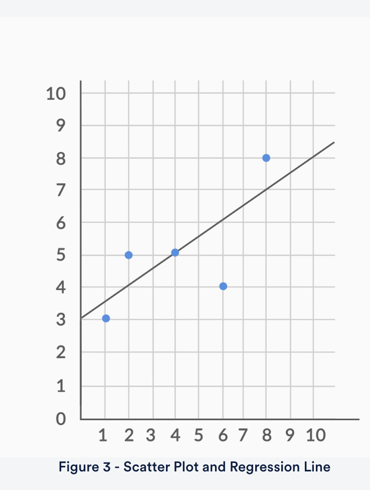

# Types of machine learning algorithms

1. **Regression:** The output variable to be predicted is a continuous variable , e.g. scores of a student
2. **Classification:** The output variable to be predicted is a **categorical variable** , e.g. classifying incoming emails as spam or ham
3. **Clustering**: **No pre-defined notion of a label** is allocated to groups/clusters formed, e.g. customer segmentation

# Machine learning methods

You can classify machine learning models into two broad categories:

1. **Supervised learning methods**
   1. Past data with labels is used for building the model
   2. **Regression** and **classification** algorithms fall under this category
2. **Unsupervised learning methods**
   1. No pre-defined labels are assigned to input data
   2. **Clustering** algorithms fall under this category

Notes:

* You build the model based on training data
* You test the model using new set of data called training data
* You predictive the output of training data set using your model. This step is called as predictive analysis

# Linear Regression

* A statistical method that allows us to summarize and study relationships between two continuous (quantitative) variables
* One variable, denoted x (input), is regarded as the predictor, explanatory, or independent variable.
* The other variable, denoted y (output), is regarded as the response, outcome, or dependent variable.
* Here we trying to setup a relationship between X (weight of vehicle, Advertising expense and hour of study per week ) and Y ( Fuel efficiency , Corporate performance and Student performance )

## Two types of regression

1. Simple Linear Regression: Model with only 1 independent variable
2. Multiple Linear Regression: Model with more than 1 independent variable

## Formula:

y = mx + c

**y** = how far up

**x** = how far along

**m** = Slope or Gradient (how steep the line is)

**c** = value of **y** when **x=0 (intercept)**

## Best Fit Regression Line

Residual formula:

e_actual = y_actual - y_pred

The best-fit line is obtained by minimising a quantity called Residual Sum of Squares (RSS)

i.e. by minimizing e1^2 + e2^2 + e3^2 + ..... +en^2 = RSS

## What Is Cost Function of Linear Regression?

* Cost function measures the performance of a machine learning model for a data set.
* Cost function quantifies the error between predicted and expected values and presents that error in the form of a single real number.
* Depending on the problem, cost function can be formed in many different ways. The purpose of cost function is to be either minimized or maximized.
* For algorithms relying on **gradient descent** to optimize model parameters, every function has to be differentiable.
* Here, Cost function = RSS; and we are trying to find ways to minimize RSS

### Ways to minimize cost function:

1. Differentiation
2. Gradient descent approach

#### Gradient Descent

Gradient Descent is an optimisation algorithm which optimises the objective function (for linear regression it's cost function) to reach to the optimal solution.

#### R-squared = coeffifient of determination, RSS and TSS

* **TSS (Total sum of squares)**: Instead of adding the actual value’s difference from the predicted value, in the TSS, we find the difference from the mean y the actual value. This can be used as a basic model for linear regression even if we don't know how to find the best fit line.
  * Sum of squares = Sum of -- (yMean - yActual)^2 --- from i = 1 to n
* We can use RSS/TSS to find out the ratio of how good our model is.
* Infact, we actually use R^2 (Coefficient of determination) to find out how good our model is, R^2 is computed as 1 - (RSS/TSS)
* The closer the R^2 to 1 is the better the model is

RSS = 6.25

Mean = 3+5+5+4+8 = 25/5 = 5

TSS = (2^2) + (0^2) + (0^2) + (1^2) + (3^2) = 14

R^2 = 1 - RSS/TSS = 1- (6.25/14) = 0.55

##### RSE (Residual Square Error)

RSE = sqrt(RSS/df) ;

(degree of freedom) df = n-2 where n = number of data points

## Multiple Linear Regression

It represents the relationship between two or more independent input variables and a response variable. Multiple linear regression is needed when one variable might not be sufficient to create a good model and make accurate predictions.

The formulation for predicting the response variable now becomes:

**Y**=**β**0**+**β**1**X**1**+**β**2**X**2**+**.**.**.**+**β**p**X**p**+**ϵ**

Apart from the formulation, there are some other aspects that still remain the same:

1. The model now fits a hyperplane instead of a line (imagine multi-dimensional graph)
2. Coefficients are still obtained by minimising the sum of squared errors, the least squares criteria
3. For inference, the assumptions from simple linear regression still hold - zero-mean, independent and normally distributed error terms with constant variance

---

The new aspects to consider when moving from simple to multiple linear regression are:

1. **Overfitting**
   * As you keep adding the variables, the model may become far too complex
   * It may end up memorising the training data and will fail to generalise
   * A model is generally said to overfit when the training accuracy is high while the test accuracy is very low
2. **Multicollinearity**
   * Associations between predictor variables
3. **Feature selection**
   * Selecting the optimal set from a pool of given features, many of which might be redundant becomes an important task

### Multicollinearity

Multicollinearity refers to the phenomenon of having related predictor variables in the input dataset. In simple terms, in a model which has been built using several independent variables, some of these variables might be **interrelated**, due to which the presence of that variable in the model is **redundant**. You drop some of these related independent variables as a way of dealing with multicollinearity.

Multicollinearity affects:

* **Interpretation**  Does “change in Y, when all others are held constant” apply?
* **Inference** :
  * Coefficients swing wildly, signs can invert
  * p-values are, therefore, not reliable

---

Two basic ways of dealing with multicollinearity

1. Looking at **pairwise correlations**
   * Looking at the correlation between different pairs of independent variables
2. Checking the **Variance Inflation Factor** (VIF)
   * Sometimes pairwise correlations aren't enough
   * Instead of just one variable, the independent variable might depend upon a combination of other variables
   * VIF calculates how well one independent variable is explained by all the other independent variables combined

The VIF is given by:

    **V**I**F**i=**1/i**−**R**i^**2**

where *'i'* refers to the i-th variable which is being represented as a linear combination of rest of the independent variables

**Note:** The common heuristic for VIF values is that if it is greater than 10, it is definitely high. If the value is greater than 5, it is okay but worth inspecting. And anything lesser than 5 is definitely okay.

---

Some methods that can be used to deal with multicollinearity are:

1. **Dropping variables**
   * Drop the variable which is highly correlated with others
   * Pick the business interpretable variable
2. **Create new variable** using the interactions of the older variables
   * Add interaction features, i.e. features derived using some of the original features
3. **Variable transformations**
   * Principal Component Analysis

### Scaling

Scaling helps bring all the independent variables on the same scale.

It is important to note that **scaling just affects the coefficients** and none of the other parameters like t-statistic, F-statistic, p-values, R-squared, etc.

There are two major methods to scale the variables,

1. Standardisation
   * Standardisation basically brings all of the data into a standard normal distribution with mean zero and standard deviation one.
   * Standardisation:**x = x−mean(x)/sd(x)**
2. MinMax scaling.
   * MinMax scaling, brings all of the data in the range of 0 and 1.
   * MinMax Scaling:**x = x−min(x)/max(x)−min(x)**
   * Prefer using this, because it takes care of outliers

### Model assessment and comparison

Penalize models for using higher number of predictors

Hence, there are two new parameters that come into picture:

* **Adjusted R2 = 1− ((1−R^2)(N−1)/N−p−1)**
* **AIC = ( N * log(RSS/n) ) + 2p**

Here, **n** is the sample size meaning the number of rows you'd have in the dataset and **p** is the number of predictor variables.

### Feature Selection

**Manual feature elimination:**

1. Build the model with all the features
2. Drop the features that are least helpful in prediction (high p-value)
3. Drop the features that are redundant (using correlations and VIF)
4. Rebuild model and repeat

**Automated feature elimination:**

1. Top 'n' features: Recursive Feature Elimination
2. Forward / Backward / Step-wise selection: based on AIC
3. Regularization (Lasso)

Usually, you should do a balanced approach, i.e a combination of both automated (for coarse tuning) + manual (for fine tuning)
