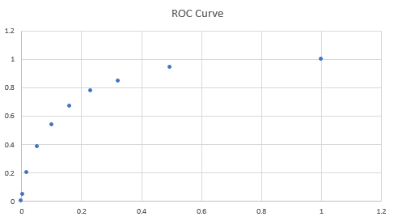

# Logistic Regression

## Pre-requisites

### Exponentials

Few properties of Exponentials:

* x^a⋅x^b = x^(a+b)
* (xy)^a = x^a.y^a
* x^a/x^b = X^(a-b) ; x != 0

### Logarithms

Few properties of Log:

* log(a)^b = b.log(a)
* log(a.b) = log(a) + log(b)
* log(a/b) = log(a) - log(b)
* (x)^3 = y is same as 3 = log (y) with base (x)

## Binary Classification

Outcomes which can be classified into two:

Eg: Whether the mails are spam or ham

But in some cases it is difficult to classify into 2 segments just based on the data we have. Eg:

Eg: 

As you can see, person below 200 are non-diabetic and person above 200 are diabetic. But we also notice people with 210 are non-diabetic. So we saw how using a **simple boundary decision method** would not work in this case.

So we have to use sigmoid curve which has all the properties you would want — extremely low values in the start, extremely high values in the end, and intermediate values in the middle — it’s a good choice for modelling the value of the **probability of diabetes**.

This is the Sigmoid curve equation:

We have to take B0 and B1 and plot the sigmoid curve which looks like below:

The sigmoid curve actually has the properties we need, i.e. extremely low values in the start, extremely high values in the end, and intermediate values in the middle.

So the question we have to answer is how to find the best B0 and B1

### Finding the best fit sigmoid curve

So, if you notice the expression above "**e**", it is minus of linear expression

If we recall, in linear regression we used "**Least sum of Squares**" to find the best fit line.

But in logistic regression we cannot do that, because the values are either 1 or 0.

We have to use something called "**Maximum Likelihood**" method to find the best fitted line.

If you, recall the Simoid curve equation, it is not very intuitive. So we try to linearize the equation.

### Interpreting P/(1-P)

So the terms are

- Odds: P/(1-P) = e^(B0+B1.x)
- Log Odds: log(P/(1-P)) = B0+ B1.x

Eg: Say P is the probability of someone being diabetic and say P/(1-P) = 4

Therefore, we can say, P(Diabetics)/P(Non-Diabetics) = 4

P(Diatetic) = 4* P(Non-Diabetic); P = 4(1-P); P = 4-4P; 5P= 4; P = 4/5; P = 8/10 = 0.8

P(Diabetic) = 0.8 (80%)

### Relation between Odds and Probability

## Model Evaluation

The most commonly used metrics to evaluate a classification model:

1. Sensitivity = No of actual Yeses correctly predicted / Total no. of actual Yeses
2. Specificity = No. of actual Nos correctly predicted / Total no. of actual Nos

### ROC Curve (Receiver Operating Characteristic)

2 important metrics to remember

1. True Positive Rate (TPR)  = True Positive / Actual Positive, or Sensitivity
2. False Positive Rate (FPR) = False Positive / Actual Negatives. or 1 - Specificity

So, a good model is where TPR is high and FPR is low.

The following is the ROC curve where X- Axis: FPR, Y-Axis: TPR.

- A good model will have points closer to Y-axis as it approaches 1
- A bad model will have points away from Y-axis as it approaches 1

The Area Under the Curve (AUC) for the Receiver Operating Characteristic (ROC) curve is a performance measurement for classification problems, the higher the AUC, the more accurate the model

### Precision and Recall

**Precision**: Probability that a predicted 'Yes' is actually 'Yes'

* Jitna tune 'Yes' bola usme se actually kitna 'Yes' hai
* same as the 'Positive Predictive Value'

**Recall**: Probability that a 'Yes' case is predicted as such

* Jitna Yes hai, usme se tune kitno ko 'Yes' bola
* Same as sensitivity

# Logistic Regression cont.

## There are two **types of logistic regression** :

1. **Binary logit:** involves two levels of the dependent variable. For example, the telecom churn example you learnt in earlier sessions is a binary logistic regression problem, as it classifies customers into two levels, churns and non-churns.
2. **Multinomial logit**: however, involves more than 2 levels of dependent variables, such as whether a customer will purchase product A, product B or not purchase anything.

## Things to consider when selecting **samples:**

1. **Cyclical** or **seasonal fluctuations** in the business that need to be taken care of while building the samples. E.g. Diwali sales, economic ups and downs, etc.
2. The sample should be **representative of the population** on which the model will be applied in the future.
3. For **rare events samples** , the sample should be balanced before it is used for modelling.

## Segmentation

Say the accuracy of your model is very low. Sometimes, segmenting the data and creating child models for them and then combining them can help build better models. This helps in increasing the predictive power of a model.

We must ensure that driving factors for each of the child models are different or have different frequency.

Let's talk about the ICICI example:

For students and salaried people, different variables may be important. While students' defaulting and not defaulting will depend on factors such as program enrolled for, the prestige of the university attended, parents' income, etc., the probability of salaried people will depend on factors such as marital status, income, etc. So, the predictive pattern across these two segments is very different, and hence, it would make more sense to make different child models for both of them, than to make one parent model.

## Transforming variables

### Dummy Variable Transformation

There are some pros and cons of transforming variables to dummies. Creating dummies for **categorical variables** is very straightforward. You can directly create n-1 new variables from an existing categorical variable if it has n levels. But for  **continuous variables** , you would be required to do some kind of EDA analysis for binning the variables.

The **major advantage** offered by **dummies** especially for continuous variables is that they make the  **model stable** . In other words, small variations in the variables would not have a very big impact on a model that was made using dummies, but they would still have a sizeable impact on a model built using continuous variables as is.

On the other side, there are some **major** **disadvantages** that exist. E.g. if you change the continuous variable to dummies, all the data will be **compressed** into very few categories and that might result in  **data clumping** .

### Weight of Evidence

**WOE** can be calculated using the following equation:

WOE = ln(good in the bucket/Total Good)−ln(bad in bucket/Total Bad)

Or, it can be expressed as:

WOE = ln(Percentage of Good/ Percentage of Bad)

Once you've calculated woe values, it is also important to note that they should follow an **increasing or decreasing trend** across bins. If the trend is not  **monotonic** , then you would need to compress the buckets/ bins (coarse buckets) of that variable and then calculate the WOE values again.

**Pros**: The model becomes more stable because small changes in the continuous variables will not impact the input so much.

**Cons**: You may end up doing some score clumping.

#### Information Value (IV)

This is a important indicator of predictive power

IV =WOE * (Percentage of good in the bucket − Percentage of bad in the bucket)

## Model Evaluation

Another way of evaluating the model is calculating the GINI of the model:

Gini = 2 * Area Under ROC Curve - 1

* It is the area between ROC curve and X-Axis
* Higher the GINI, the steeper the ROC, the better the model
