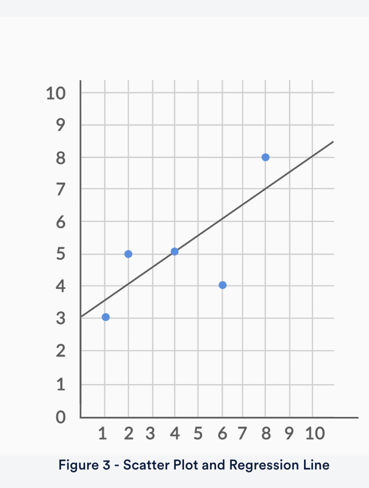

# Types of machine learning algorithms

1. **Regression:** The output variable to be predicted is a continuous variable , e.g. scores of a student
2. **Classification:** The output variable to be predicted is a **categorical variable** , e.g. classifying incoming emails as spam or ham
3. **Clustering**: **No pre-defined notion of a label** is allocated to groups/clusters formed, e.g. customer segmentation

# Machine learning methods

You can classify machine learning models into two broad categories:

1. **Supervised learning methods**
   1. Past data with labels is used for building the model
   2. **Regression** and **classification** algorithms fall under this category
2. **Unsupervised learning methods**
   1. No pre-defined labels are assigned to input data
   2. **Clustering** algorithms fall under this category

Notes:

* You build the model based on training data
* You test the model using new set of data called training data
* You predictive the output of training data set using your model. This step is called as predictive analysis

# Linear Regression

* A statistical method that allows us to summarize and study relationships between two continuous (quantitative) variables
* One variable, denoted x (input), is regarded as the predictor, explanatory, or independent variable.
* The other variable, denoted y (output), is regarded as the response, outcome, or dependent variable.
* Here we trying to setup a relationship between X (weight of vehicle, Advertising expense and hour of study per week ) and Y ( Fuel efficiency , Corporate performance and Student performance )

## Two types of regression

1. Simple Linear Regression: Model with only 1 independent variable
2. Multiple Linear Regression: Model with more than 1 independent variable

## Formula:

y = mx + c

**y** = how far up

**x** = how far along

**m** = Slope or Gradient (how steep the line is)

**c** = value of **y** when **x=0 (intercept)**

## Best Fit Regression Line

Residual formula:

e_actual = y_actual - y_pred

The best-fit line is obtained by minimising a quantity called Residual Sum of Squares (RSS)

i.e. by minimizing e1^2 + e2^2 + e3^2 + ..... +en^2 = RSS

## What Is Cost Function of Linear Regression?

* Cost function measures the performance of a machine learning model for a data set.
* Cost function quantifies the error between predicted and expected values and presents that error in the form of a single real number.
* Depending on the problem, cost function can be formed in many different ways. The purpose of cost function is to be either minimized or maximized.
* For algorithms relying on **gradient descent** to optimize model parameters, every function has to be differentiable.
* Here, Cost function = RSS; and we are trying to find ways to minimize RSS

### Ways to minimize cost function:

1. Differentiation
2. Gradient descent approach

#### Gradient Descent

Gradient Descent is an optimisation algorithm which optimises the objective function (for linear regression it's cost function) to reach to the optimal solution.

#### R-squared = coeffifient of determination, RSS and TSS

* **TSS (Total sum of squares)**: Instead of adding the actual value’s difference from the predicted value, in the TSS, we find the difference from the mean y the actual value. This can be used as a basic model for linear regression even if we don't know how to find the best fit line.
  * Sum of squares = Sum of -- (yMean - yActual)^2 --- from i = 1 to n
* We can use RSS/TSS to find out the ratio of how good our model is.
* Infact, we actually use R^2 (Coefficient of determination) to find out how good our model is, R^2 is computed as 1 - (RSS/TSS)
* The closer the R^2 to 1 is the better the model is

RSS = 6.25

Mean = 3+5+5+4+8 = 25/5 = 5

TSS = (2^2) + (0^2) + (0^2) + (1^2) + (3^2) = 14

R^2 = 1 - RSS/TSS = 1- (6.25/14) = 0.55

##### RSE (Residual Square Error)

RSE = sqrt(RSS/df) ; 

(degree of freedom) df = n-2 where n = number of data points
