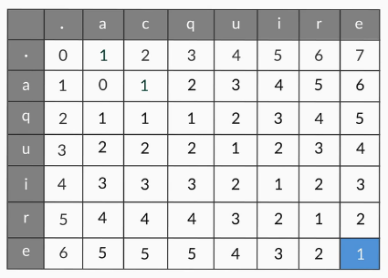

## Steps of NLP:

1. Lexical Processing:  You will just convert the raw text into words and, depending on your application's needs, into sentences or paragraphs as well.

2. Syntactic Processing: So, the next step after lexical analysis is where  we try to extract more meaning from the sentence, by using its syntax this time. Instead of only looking at the words, we look at the syntactic structures, i.e., the grammar of the language to understand what the meaning is.

3. Semantic Processing: Finding relations between words like PM and Prime Minister, King and Queen. At some point, your machine should be able to identify synonyms, antonyms, etc. on its own.

## Use cases:

- Machine Translation
- Question - Answering system
- Chatbots
- Language translation
- Conversational UI
- Sentiment Analysis

## Text Encodings

There are two most popular encoding standards:

- American Standard Code for Information Interchange (ASCII)
- Unicode
    - UTF-8 (Also backward compatible with ASCII)
    - UTF-16

### Regular Expressions

#### Python commands

> result = re.search(pattern, string) # To find the pattern in a given sentence
> result.start() # To find the starting index of the result in the sentence
> result.end() # To find the ending index of the result in the sentence

#### Quantifiers

Quantifiers allow you to mention and have control over how many times you want the character(s) in your pattern to occur.

Four types of quantifiers:

- The ‘?’ operator : Optional preceding character
- The ‘*’ operator : Match preceding character zero or more times
- The ‘+’ operator : Match preceding character one or more times (i.e. at least once)
- The ‘{m, n}’ operator:
    - {m, n}: Matches the preceding character ‘m’ times to ‘n’ times.
    - {m, }: Matches the preceding character ‘m’ times to infinite times, i.e. there is no upper limit to the occurrence of the preceding character.
    - {, n}: Matches the preceding character from zero to ‘n’ times, i.e. the upper limit is fixed regarding the occurrence of the preceding character.
    - {n}: Matches if the preceding character occurs exactly ‘n’ number of times.
- () grouping : The parentheses. If you put the parentheses around some characters, the quantifier will look for repetition of the group of characters.
- | operator : The pipe operator. 'OR'
- Escape Sequence '\' : Needed for Special characters: ‘?’, ‘*’, ‘+’, ‘(‘, ‘)’, ‘{‘, 
- Regex Flags: 
    - re.I : ignore the case of the text
    - re.M : enables you to search in multiple lines

re.compile(): This function stores the regular expression pattern in the cache memory and is said to result in a little faster searches. You need to pass the regex pattern to re.compile() function.

#### Anchors and wildcard

Anchors are used to specify the start and end of the string.

- '^': Indicates start of a string. Eg: "^J"
- '$': Indicates end of a string. Eg: "a$"

Wildcard

- '.': Matches any character

#### Character sets

- []: Match any characters inside these square brackets. 

*  A quantifier loses its special meaning when it’s present inside the character set. Inside square brackets, it is treated as any other character. 

- '^': When inside the square brackets, It is used inside character set to indicate complementary set
Eg: [^abc] means match anything but abc

| Pattern  | Matches                                                                                    |
|----------|--------------------------------------------------------------------------------------------|
| [abc]    | Matches either an a, b or c character                                                      |
| [abcABC] | Matches either an a, A, b, B, c or C character                                             |
| [a-z]    | Matches any characters between a and z, including a and z                                  |
| [A-Z]    | Matches any characters between A and Z, including A and Z                                  |
| [a-zA-Z] | Matches any characters between a and z, including a and z ignoring cases of the characters |
| [0-9]    | Matches any character which is a number between 0 and 9                                    |

#### Meta Sequences

| Pattern  | Equivalent to    |
|----------|------------------|
| \s       | [ \t\n\r\f\v]    |
| \S       | [^ \t\n\r\f\v]   |
| \d       | [0-9]            |
| \D       | [^0-9]           |
| \w       | [a-zA-Z0-9_]     |
| \W       | [^a-zA-Z0-9_]    |

#### Greedy vs Non greedy Search

When you use a regular expression to match a string, the regex greedily tries to look for the longest pattern possible in the string. For example, when you specify the pattern 'ab{2,5}' to match the string 'abbbbb', it will look for the maximum number of occurrences of 'b' (in this case 5).

This is called a 'greedy approach'. By default, a regular expression is greedy in nature.

There is another approach called the non-greedy approach, also called the lazy approach, where the regex stops looking for the pattern once a particular condition is satisfied. 'ab{2,5}' will stop after matching with 'abb'.

* To use a pattern in a non-greedy way, you can just put a question mark at the end of any of the quantifiers. *?, +?...

#### Commonly used RE functions

- match(): Determine if the RE matches at the beginning of the string
- search(): Scan through a string, looking for any location where this RE matches
- sub(): Find all substrings where the RE matches and substitute them with the given string. re.sub(pattern, replacement, string)
- finditer() Find all substrings where RE matches and return them as an iterator
- findall(): Find all the substrings where the RE matches, and return them as a list

#### Grouping

- Use "()" for grouping
- results.group(n): n: 0 = all, 1 = 1st group, 2 = 2nd group ....
- regex inside "()" will be considered part of a group

### Basic Lexical Processing

The Zipf's law (discovered by the linguist-statistician George Zipf) states that the frequency of a word is inversely proportional to the rank of the word, where rank 1 is given to the most frequent word, 2 to the second most frequent and so on. This is also called the power law distribution.

The Zipf's law helps us form the basic intuition for stopwords (is, the, that, an ...) - these are the words having the highest frequencies (or lowest ranks) in the text, and are typically of limited 'importance'.

Broadly, there are three kinds of words present in any text corpus:
- Highly frequent words, called stop words, such as ‘is’, ‘an’, ‘the’, etc. Generally, stopwords are removed unless they prove to be very helpful in your application or analysis.
- Significant words, which are typically more important to understand the text
- Rarely occurring words, which are again less important than significant words

#### Tokenization

Tokenisation - a technique that’s used to split the text into smaller elements. These elements can be characters, words, sentences, or even paragraphs depending on the application you’re working on.

In NLTK, you also have different types of tokenisers present that you can use in different applications. The most popular tokenisers are:

- Word tokeniser splits text into different words.
- Sentence tokeniser splits text in different sentence.
- Tweet tokeniser handles emojis and hashtags that you see in social media texts
- Regex tokeniser lets you build your own custom tokeniser using regex patterns of your choice.

So, now we have 2 pre-processing steps:
- Tokenization
- Removing stop words

#### Bag-of-words representation

The central idea is that any given piece of text, i.e., tweets, articles, messages, emails etc., can be “represented” by a list of all the words that occur in it (after removing the stopwords), where the sequence of occurrence does not matter. You can visualise it as the “bag” of all “words” that occur in it.

Two ways
 1) you can either fill the cell with the frequency of a word (i.e. a cell can have a value of 0 or more), or 
 2) fill the cell with either 0, in case the word is not present or 1, in case the word is present (binary format).

This still leaves us with a problem of redundant tokens, like different variations of the same word, say "warm", "warmer", "warming" and "warmed". These all can be represented by a single token - "warm".

*Stemming* makes sure that different variations of a word, are represted by a single "stem" of the word.

##### Stemming and Lemmatization

Stemming

It is a rule-based technique that just chops off the suffix of a word to get its root form, which is called the ‘stem’.

2 popular stemmers:
- Porter stemmer
- Snowball stemmer

Lemmatization

This is a more sophisticated technique (and perhaps more 'intelligent') in the sense that it doesn’t just chop off the suffix of a word. Instead, it takes an input word and searches for its base word by going recursively through all the variations of dictionary words. The base word in this case is called the lemma. Words such as ‘feet’, ‘drove’, ‘arose’, ‘bought’, etc. can’t be reduced to their correct base form using a stemmer. But a lemmatizer can reduce them to their correct base form. The most popular lemmatizer is the WordNet lemmatizer created by a team of researchers at the Princeton university.

- A stemmer is a rule based technique, and hence, it is much faster than the lemmatizer. A stemmer typically gives less accurate results than a lemmatizer.  

#### TF-IDF Representation

TF: Term Frequency
IDF: Inverse document frequency

The TF-IDF representation, also called the TF-IDF model, takes into the account the importance of each word

TF(t,d) = Frequency of term 't' in document 'd' / total terms in document 'd'
IDF(t) = log (total number of documents/ total documents that have the term 't')

> tf-idf score for any term in a document  = TF(t,d) * IDF(t)

Higher weights are assigned to terms that are present frequently in a document and which are rare among all documents. On the other hand, a low score is assigned to terms which are common across all documents.

### Advanced Lexical Processing

#### Canonicalisation

Canonicalisation means to reduce a word to its base form. Stemming and lemmatization were just specific instances of it. Stemming tries to reduce a word to its root form. Lemmatization tries to reduce a word to its lemma.

##### Phonetic Hashing

Phonetic hashing buckets all the similar phonemes (words with similar sound or pronunciation) into a single bucket and gives all these variations a single hash code. Hence, the word ‘Dilli’ and ‘Delhi’ will have the same code.

Phonetic hashing is done using the Soundex algorithm. American Soundex is the most popular Soundex algorithm. It buckets British and American spellings of a word to a common code. It doesn't matter which language the input word comes from - as long as the words sound similar, they will get the same hash code.

American Soundex Algorithm:

1) Retain the first letter of the word as is
2) Replace consonants with digits accordingly:
    - b,f,p,v -> 1
    - c,g,j,k,q,s,x -> 2
    - d,t -> 3
    - I -> 4
    - m,n  -> 5
    - r -> 6
    - h,w,y -> unencoded
3) Remove all the vowels
4) Continue till the code has one letter and three numbers. If the length of code is greater than four then truncate it to four letters. In case the code is shorter than four letters, pad it with zeroes

Chennai -> CE55AI -> C5 -> C500

##### Edit distance

An edit distance is the number of edits that are needed to convert a source string to a target string.

Possible edits are:
- Insertion of a letter
- Deletion of a letter
- Modification of a letter

Applaud -> Apple 
You need three edits. Substitution of ‘a’ to ‘e’ in a single edit. Then you require two deletions - deletion of the letters ‘u’ and ‘d’.

It's not straightforward to calculate edit distance between complex words.

Few algos to calculate the edit distance:

1) Levenshtein edit distance algorithm
    
2) Damerau–Levenshtein distance
    -  apart from allowing the three edit operations, also allows the swap (transposition) operation between two adjacent characters which costs only one edit instead of two.

#### Spell Corrector

Check out the spell_corrector.ipynb

Basically trying to build a spell corrector by finding closest correct words by 1 edit or 2 edits using a dictionary and then finding it's probability from the document

#### Pointwise mutual information

Sometimes you want continuous words to be represented by a single token rather than multiple tokens. Eg: "International Institute of Information Technology". There is metric called PMI score which can be given to each of these terms and if the PMI score is higher than certain threshold you can replace these terms with a single term such as "International_Institute_of_Information_Technology"

how to calculate PMI of a term that has two words. The PMI score for such term is:

PMI(x, y) = log ( P(x, y)/P(x)P(y) )

For terms with three words, the formula becomes:

PMI(z, y, x)    = log [(P(z,y,x))/(P(z)P(y)P(x))]
                = log [(P(z|y, x)*P(y|x))*P(x)/(P(z)P(y)P(x))]
                = log [(P(z|y, x)*P(y|x))/([P(z)P(y))])]

Eg:

The Nobel Prize is a set of five annual international awards bestowed in several categories by Swedish and Norwegian institutions in recognition of academic, cultural, or scientific advances

In the 19th century, the Nobel family who were known for their innovations to the oil industry in Azerbaijan was the leading representative of foreign capital in Baku.

The Nobel Prize was funded by personal fortune of Alfred Nobel

The Board of the Nobel Foundation decided that after this addition, it would allow no further new prize

P(nobel) = 4/4
P(prize) = 3/4
P(Nobel Prize) = 2/4
PMI(Nobel Prize) = log(0.5/0.75) = -0.17