# Semantic Processing

## Knowledge graph

In the knowledge graph, entities are represented by nodes, where some pairs of the entities are related in some sense. These relations are represented by edges.

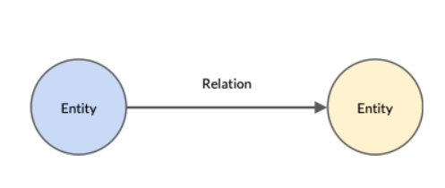

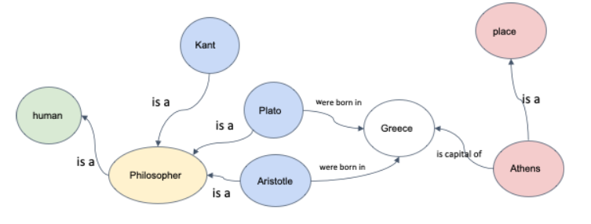

The different types of knowledge graphs are as follows:

WordNet: This is a lexical database of semantic relations between words. It is developed by Princeton University.

ConceptNet: This is a freely available semantic network that is designed to help computers understand the meanings of words that people use. It is developed by MIT.

Unified Medical Language System (UMLS): It is a set of files and software that brings together many health and biomedical vocabularies and standards to enable interoperability between computer systems.

---

**Synset** is a special kind of a simple interface that is present in NLTK to look up words in WordNet. Synset instances are the groupings of synonymous words that express the same concept. Some of the words have only one Synset and some have several.

### Relation between senses

1) Synonym: A relation between two similar concepts

   - Example: Large is a synonym of big.
2) Antonym: A relation between two opposite concepts

   - Example: Small is an antonym of big.
3) Hypernym: A relation between a concept and its superordinate

   - A superordinate is all-encompassing.
   - Example: Fruits is the hypernym of mango.
4) Hyponym: A relation between a concept and its subordinate

   - Example: Apple is the hyponym of fruits.
5) Holonym: A relation between a whole and its parts

   - Example: Face is the holonym of eyes.
6) Meronym: A relation between a part and its whole.

   - Example: Eyes is the meronym of human body

### Lesk Algorithm

- It is unsupervised "Word Sense Disambiguation (WSD)" algorithm based on comparing disctionary definitions of the word and it's neighbouring words
- It chooses the sense with most word overlap between gloss and context

## Distribution Semantics

“You shall know a word by the company it keeps.”

let us assume that one does not know the meaning of the word ‘credit”

After reading the sentence ‘The money was credited to my bank account’, one can easily infer that the word ‘credit’ is related to the exchange of currency. The words ‘money’ and ‘account’ set a context to the sentence that implies the predicted meaning. Through intelligent predictions such as this one, the meaning of words in a sentence becomes quite intuitive.

- Distributional semantics creates word vectors such that the word’s meaning is captured from its context.

### Geometrical representation of Meaning

Distributional semantics lets you capture the meaning of the word as vectors. The different aspects of meaning can be captured using geometry.

Example of plotting King, Queen, Man and Woman on a plot of Speciality vs Femininity

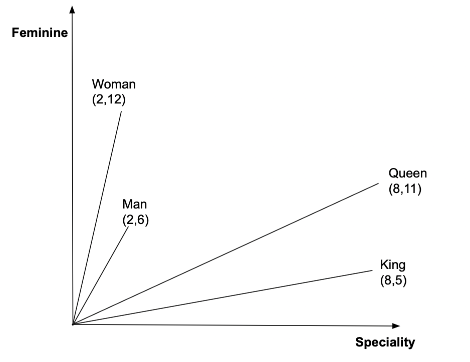

Also, you can traverse between these points, for example, King - Man + Woman = Queen. Just do vector addition/subtraction.

The fundamental way of measuring the similarity between two vectors is the **cosine similarity**.

According to the value of cosine similarity, one can infer several factors about a relations between words:

- For smaller θ, the cosine value is close to 1. Such words are called synonymous words.
- For θ = 90 and cos(θ) = 0 corresponds to unrelated words.
- For θ values where the cosine value is negative, words are called antonyms

cos(θ) can take any values from -1 to 1.

How to calculate cosine similarity,

> S(x,y) = cos(θ) = x.y / ||x||.||y||

x.y = dot product of the vectors 'x' and 'y'
||x||,||y|| = magnitude of 'x' and 'y' respectively

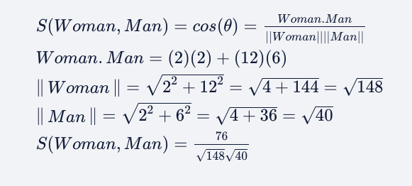

### Word to Vector Model

- You shall know a word by the company it keeps
- If a machine can predict the words from their context, then it would have captured the meaning of the word

Sent: "All that 'glitter' is not gold"

Step 1: Make a neural network that predicts a word, given the nearby words as shown below.

Step 2: Wait for it to predict well enough. Train the neural network such that the probability of the glitters is the highest in the output layer, as the network is trying to predict glitters as shown below.

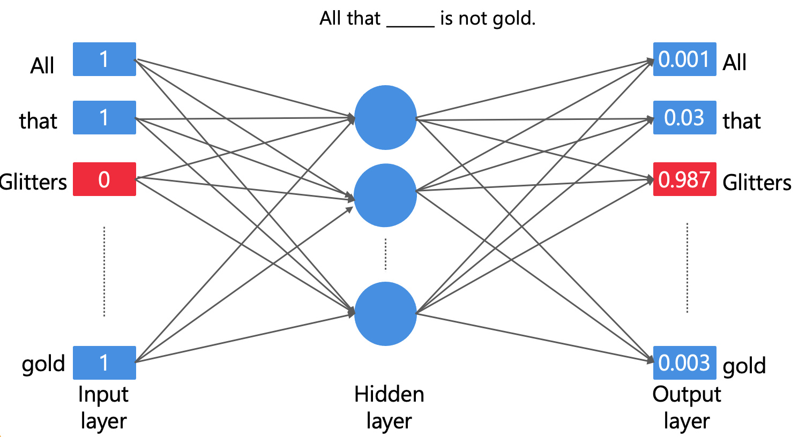

Step 3: Find out what it has learnt (the weights)
Surprisingly, the output of the neural network is not what we are interested in, although this is what is generally extracted from neural networks. Instead, we are interested in the weight matrices which contain the semantic information, known as **word embeddings**.

### Approaches for Word2Vec

- Skip-gram model

  - Predicts words within a certain range before and after the input word
  - "glitter" is the input word
  - "All that" "is not gold" are the predicted words
- Continuous Bag Of words (CBOW)

  - Predicts the middle words based on the surrounding words
  - "All that" "is not gold" are the input/surrounding words
  - "glitters" is the predicted word

### Input data for CBOW

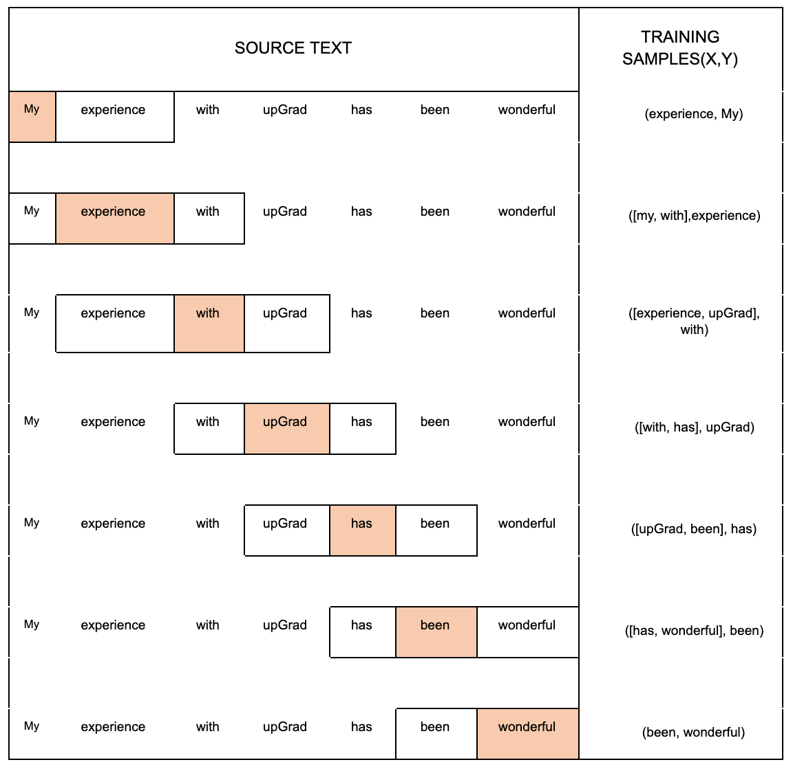

One Hot Encoding is used to convert words into a numeric format. The words can be arranged in alphabetical order or based on frequency or any other heuristic. One hot encoding of the words in our example can be represented as follows.

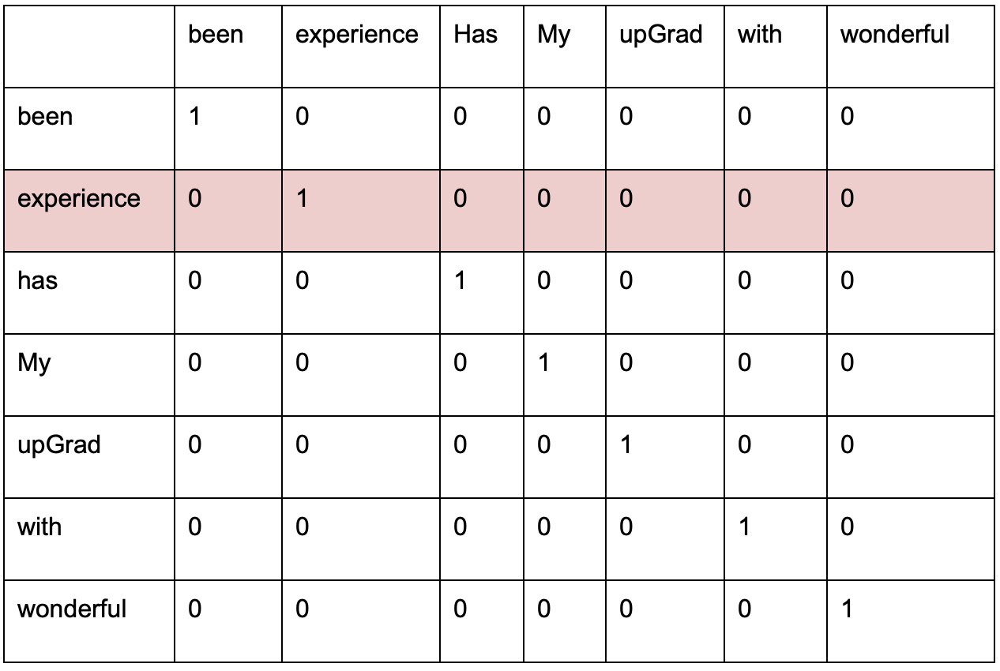

From this table, the one hot encoding of ‘experience’ is as follows. The position of the ‘1’ is in the second position as the mapping has been done according to the table above.

### Training of CBOW model

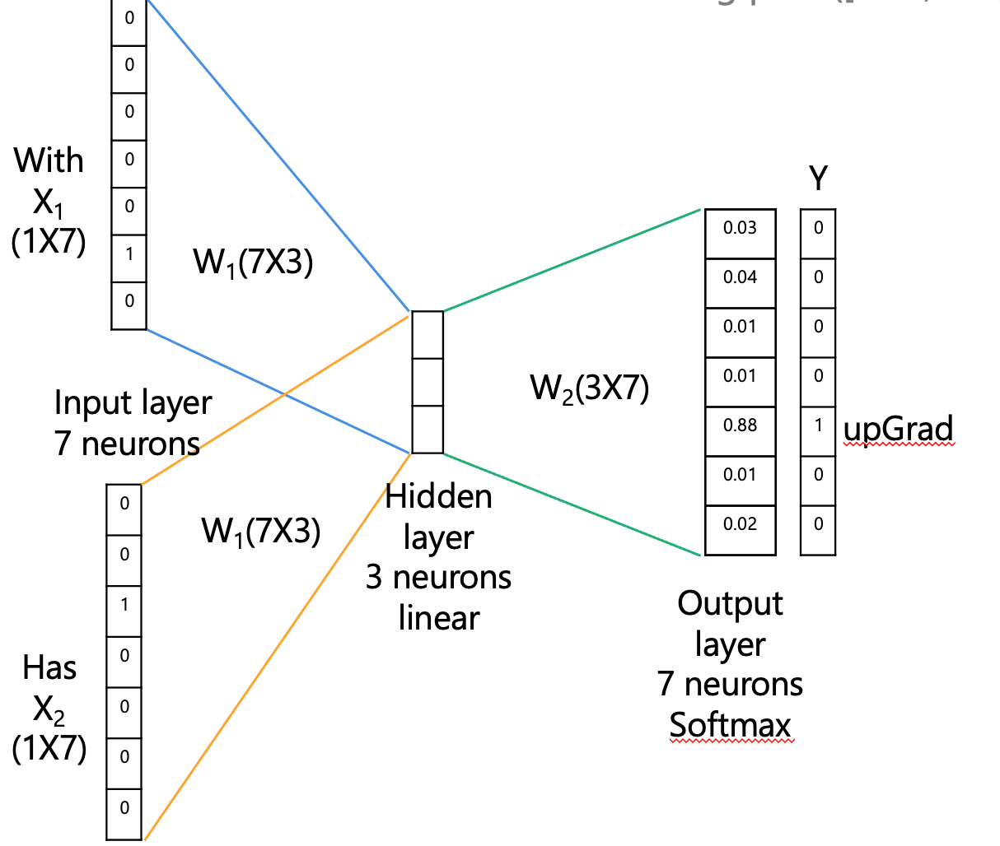

For a training pair ([with, has], upGrad) 

input X = [with,has] 

output Y = upGrad

The task of the neural network is to predict the output, given the following input.

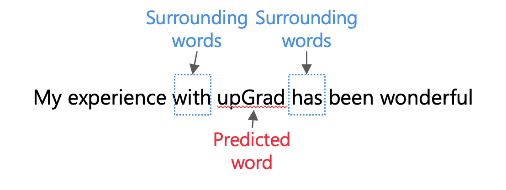

One hot encoding of the words ‘with’ and ‘has’ will be the inputs of the neural network, and the output of the network should be upGrad.

The OHE of the inputs flows through the network in the forward pass in the following manner:

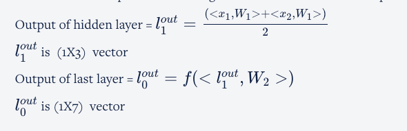

The neural network uses a backpropagation algorithm that compares the actual output and predicted output and tries to minimise the loss

#### Weight Matrices

- Weight matrices are word embeddings
- Every row of weight matrix is a word vector
- Size of the word embeddings can be much smaller that the OHE representations
- Multiplication of OHE with the embedding matrix is equivalent to a lookup

We have considered W1 as our embedding matrix.

You understood that if you multiply the one hot encoding form of the word with the matrix, you will obtain word embedding of that word. As seen in the video, the OHE of upGrad is as follows.

upgrad: 0 0 0 0 1 0 0

W1: 
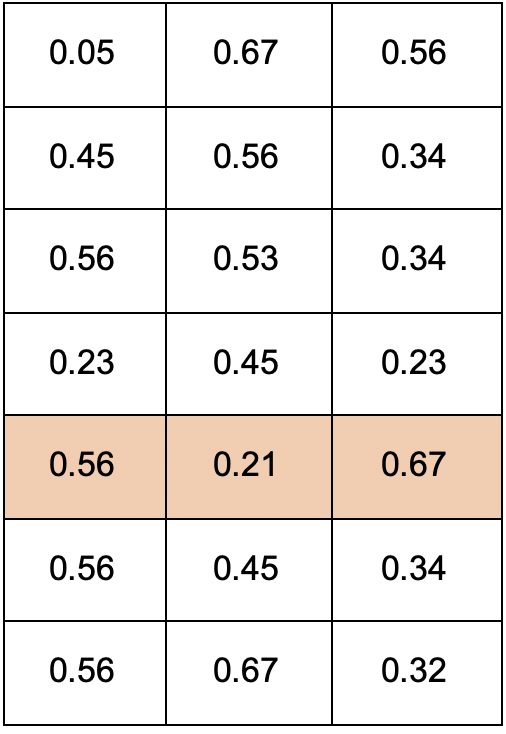

The word embedding or word vector of upGrad is: 0.56 0.21 0.67

You will observe that every row in the weight matrix W_1 is a word embedding. Rather than multiplying the OHE by a weight matrix, we can directly pick the row according to the position of 1 in OHE and use W_1 as a look-up matrix.

The word embedding of a word not only captures the meaning of the word but also reduces the dimensions of the word vector. The dimension of word vector (OHE) was 7, which was reduced to 3 in the word embedding. 

The neural network learns by minimising the loss function and maximising the dot product between the input word vector and the output word vector. 

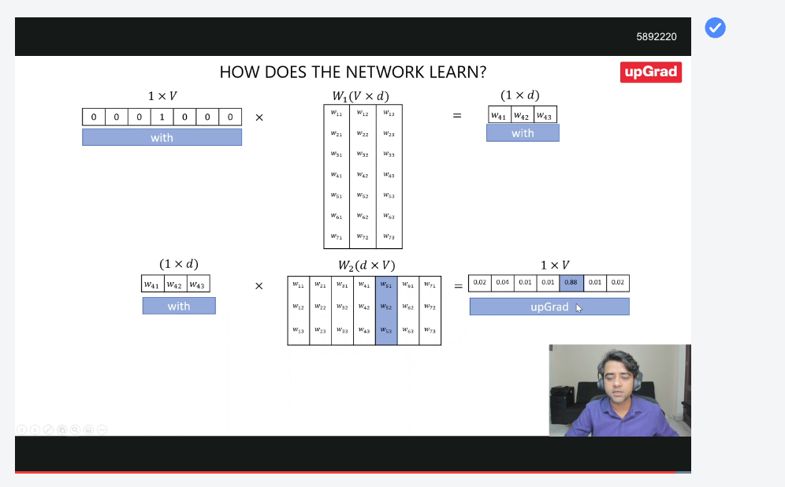

Note: W_1 and W_2 are not transposes of each other, although we have considered W_1 to be our word embedding matrix in our calculations. 

(w41)(w51) + (w42)(w52) + (w43)(w53) needs to be maximised over multiple back propogations to predict the correct word "upgrad".

### Skip-Gram Model

- Predict the surrounding words given the target word
- Input word: "glitters"
- Predicted/Surrounding words: "All that" "is not gold"
- Exactly opposite to CBOW

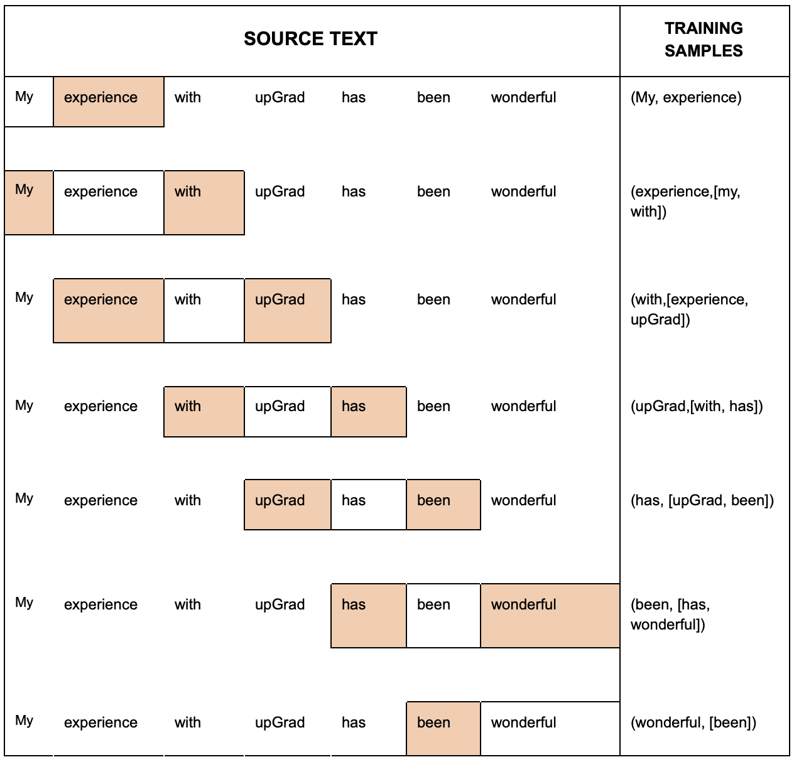

The architecture of skip-gram is the same as the CBOW model.
The neural network is a shallow neural network with 1 hidden layer.
The input layer and the output layer have 7 neurons, and this is equal to the size of the vocabulary. 
The hidden layer has a linear activation function, whereas the output layer has the softmax activation function.

The difference appears when you perform forward pass and backpropagation.

The main difference is in the output of the first layer, which appears when you take the average of two input words in CBOW, but it is not necessary to consider the average of the input words, as only one input word is present in the skip-gram model.

The output of the first layer in CBOW is 
l out-1 = (<x1,W1>+<x2,W2>)/2

On the contrary, the output of the first layer in skip-gram is l out-1 = <x1,W1>

The differentiating factor in the backpropagation step is that the error needs to be calculated for the two output words [with,has] in the skip-gram model as shown below.

After training the skipgram model, the weight matrix W1 is a word embedding matrix, which is the same as the CBOW model. 

## Architecture of Binary Classification

Binary classification is used to decrease the computational load. In the previous session, our text corpus had a vocabulary of size 7. In reality, the text corpus has a huge vocabulary size of approximately half a million.

| Language | Approximate Number of Words | Dictionary |
| -------- | --------------------------- | ---------- |
| English  | 4,700,000                   | Webster    |
| Dutch    | 4,00,000                    | Woordenboek|
| Tamil    | 3,80,000                    | Sorkuvai   |
| Chinese  | 3,78,000                    | Hanyu Da Cidian |

For a text corpus that has half a million vocabulary size, the output layer will have to compute the softmax function for half a million neurons

------

In the original CBOW model, we had to predict a centre word given one or more context words. 
In the skip gram model, we had to predict context words given a centre word. 
In both cases, it was a classification problem with half a million classes.

So we change the problem statement for it to become a binary classification problem.
In binary classification, if  given a pair of words, it predicts if they are in each other’s context.

The input to the input layer will be concatenation/addition/other heuristic of the OHE of a pair of words. The output neuron will predict 1 if the pairs occur in each other’s context or will output 0 if the pair does not occur in each other’s context. If we consider the following example.

‘The quick brown fox jumps over the lazy dog’

For the context size of 2:
The pair (quick, fox) will give an output of 1.
The pair (quick, jumps) will give an output of 0.

### Sampling

We need to create samples for training data, the samples need to have both positive and negative samples.
Example of positive sampling:

et’s recall the corpus that we used before: A Tale of Two Cities

Corpus:

“It was the best of times,

it was the worst of times.

It was the age of wisdom,

it was the age of foolishness.

It was the season of Light,

it was the season of Darkness.

It was the spring of hope,

it was the winter of despair.”

Now, we will make a pair of the samples that occur in the context size of 2. We need to make positive and negative samples.

|X|Y|
|-|-|
|(‘best', ‘times')|1|
|(‘worst’, ‘times’)|1|
|(‘age’, ’wisdom’)|1|
|(‘age, ’foolishness’)|1|
|(‘season’,’light’)|1|
|(‘season’, ‘darkness’)|1|
|(‘spring’, ‘hope’)|1|
|(‘winter’, ‘despair’)|1|

For a classifier, we require negative samples, as it cannot classify if there is only one label

- When parsing the corpus, pick a word as a context word
- Pick a *random*, *infrequent* word from the vocabulary as target word
- Label this pair as a negative sample

|X|Y|
|-|-|
|(‘best’, ‘spring’)|0|
|(‘times’, ’hope’)|0|
|(‘worst’, ’spring’)|0|
|(‘times’, ’despair’)|0|
|(‘age’, ‘winter’)|0|
|(‘best’, ‘despair’)|0|
|(‘wisdom’, ’despair’)|0|
|(‘worst’, ’hope’)|0|

### Text preprocesing

text-preprocessing.ipynb

w2v-text-classification.ipynb

## Topic Modelling

How does topic modelling work? Before understanding various algorithms, you will learn how a human would infer a topic from a given sentence.

Suppose you are given this sentence: 
"Croatia fought hard before succumbing to France’s deadly attack, lost the finals 2 goals to 4."

On reading the first part of the sentence ‘Croatia fought hard before succumbing to France’s deadly attack’, one would infer that the context of the sentence is war. This inference is primarily due to the usage of ‘fought hard’ and ‘deadly attack’. However, on reading the next part ‘lost the finals 2 goals to 4’, the context changes to sports, specifically soccer. This is due to the usage of the words ‘finals’ and ‘goals’. 

### Algorithms

- Non-negative matric factorization
- Latent Dirichlet allocation
- Latent semantic analysis

#### Non-negative matric factorization (NMF)

NMF approximates a matrix X as a product of two matrices W, H such that X ~ WH where W >=0 and H>=0.

The formula for calculating the frobenius norm for matrix A is as follows where m and n represent number of rows and columns respectively.

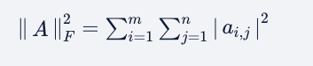

This is done by minimising the square difference between X and W * H (also know as Frobenius Norm). This is an optimisation problem, as the equation tries to get as close to the minimum value as possible.

min || X - WH || ^2 such that W >= 0 and H >= 0 

The dimensions of W, H depend on the number of topics. 
The original matrix X is of the size (number of documents X number of "terms") - Document term input
This is broken down into W of the size (number of documents X number of "topics") - Document Topic
H of the size (number of topics X number of terms) - Topic Term

----
 
You need to keep in mind that NMF or any other topic modelling algorithm does not give you the topics explicitly. Topics are neither coherent or self-contained nor meaningful ideas or concepts. A topic is a bag of words. It is the responsibility of data scientists to assign topics using domain knowledge and logic. 

 