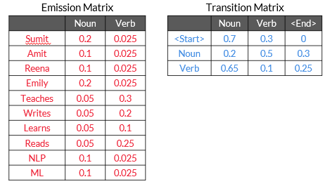
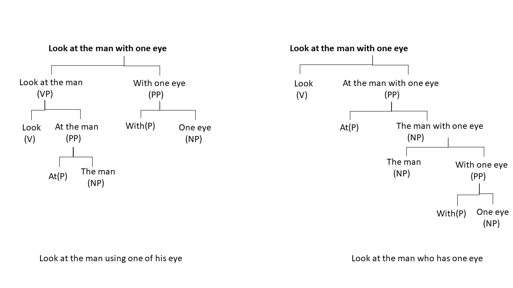

Syntax: A set of rules that govern the arrangement of words and phrases to form a meaningful and well formed sentence

Syntactic Processing: A subset of NLP that deals with the syntax of the language. It forms the backbone of various NLP applications where it is crucial to understand the meaning and structure of language

Applications: Siri, Alexa, Chatbots, Grammarly

## Parts of Speech

'You are learning NLP at upGrad.'

We know that in this sentence, 'NLP' and 'upGrad' are nouns, the word 'learning' is a verb and 'You' is a pronoun. These are called the parts of speech tags of the respective words in the sentence. A word can be tagged as a noun, verb, adjective, adverb, preposition, etc., depending upon its role in the sentence. These tags are called the PoS tags.

A PoS tag can be classified in two ways: open class and closed class.

Open class refers to tags that are evolving over time and where new words are being added for the PoS tag:

- Noun
- Verb
- Adjective
- Adverb
- Interjection
- Proper noun

Closed class refers to tags that are fixed and do not change with time.

- Prepositions
- Pronouns
- Conjunctions
- Articles
- Determiners
- Numerals

### PoS Tagging

Simple frequency-based PoS tagger: 
- You assign the most frequent PoS tags that appear in the training data to the test dataset, and you realise that rule based tagger gives good results most of the time. But, sometimes, it does not give satisfactory results because it does not incorporate the context of the word. 

#### Hidden Markov Model

Context plays an important role in determining the PoS tag of words in a sentence.

**Sequence labelling** is the task of assigning the respective PoS tags of the words in the sentence using the PoS tag of the previous word in the sentence.

**Hidden Markov Model** can be used to do sequence labelling, which means that it takes input of words in a sequence and assigns the PoS tags to each word based on the PoS tag of the previous word. 

Why Hidden Markov Model is called 'Hidden':

- When you observe (read/listen) a sentence, you only observe the words in the sentence and not their PoS tags; thus, PoS tags are hidden.
- You must infer these hidden tags from your observations, and that's why Hidden Markov Model is called Hidden.

There are majorly two assumptions that HMM follows, which are as follows:
- The PoS tag of the next word is dependent only on the PoS tag of the current word.
- The probability of the next word depends on the PoS tag of the next word. 

**Emission matrix**: This matrix contains all words of the corpus as row labels; the PoS tag is a column header, and the values are the conditional probability values.

**Transition matrix**: This matrix contains PoS tags in the column and row headers.

Let's take a look at the first row of the table; it represents that 0.7 is the probability of occurrence of a noun at the start of the sentence in the training dataset. In the same way, 0.3 is the probability of occurrence of a verb at the start of the sentence in the training dataset.

 

If you take a look at the second row, then you will see that 0.2 is the probability of occurrence of noun just after a noun in the training dataset, and similarly, 0.5 is the probability of occurrence of a verb just after a noun in the training dataset.

*** Calculating the score for a sequence ***

Calculate the score for the NNN sequence from the above diagram for the sentence:
"Sumit Teaches NLP"

Score of NNN: 
[P(Start-Noun) * P(Sumit|Noun)] * [P(Noun-Noun)*P(teaches|Noun)] * [P(Noun-Noun) * P(NLP|Noun)]

(0.7*0.2) *  (0.2*0.05)  * (0.2*0.1) = 0.000028

Score of NVN:
[P(Start-Noun)*P(Sumit|Noun)] * [P(Noun-Verb)*P(teaches|Verb)] * [P(Verb-Noun) * P(NLP|Noun)]

(0.7*0.2) * (0.5*0.3) * (0.65*0.1) = 0.001365

There are many combinations of PoS tags possible for the sentence 'S' such as NVN, NNN, VVV and VVN or NNV.
If you calculate the total number of combinations for this example, then you will see that there are only noun and verb tags; hence, 2^3 will be the total number of combinations possible.

> tags ^ terms

**Heteronyms** are words that have the same spelling but mean differently when pronounced differently.

- The doctor started to wind the bandage around my finger.
- The strong wind knocked down the tree.

### Constituency Parsing

A group of words that functions together as a single unit - a constituent

Constituency parsing is the process of identifying the constituents in a sentence and the relation between them.

Eg: "upGrad is a great platform"

Sentence constituent:
1. S (upGrad is a great platform)
    - NP: Noun phrase (upGrad) 
    - VP: Verb phrase (is a great platform) 
2. Sentence words:  'upGrad', 'is', 'a', 'great', 'platform'
3. Part-of-speech tags: NNP, VBZ, NP, DT, JJ, NN 

To understand ambiguity with a parse tree, let's consider the following sentence.
         
 “Look at the man with one eye.”

 

This sentence may have the following two meanings: 

1. Look at the man using only one of his eyes.
2. Look at the man who has one eye.

### Dependency Parsing

Dependency Parsing, as the name suggests aims at uncovering the dependencies between individual lexical items (words) and does not depend on the order of these items

- Unlike constituency parsing, dependency parsing does not describe the overall structure of the sentence
- It only identifies relations (dependencies) between individual words in a sentence and produces a concise representation of these dependencies

In the example 'upGrad is a great platform', constituency parsing fails to explain how 'great' is related to the two nouns of the sentence 'upGrad' and 'platform'. Is 'great' related more to 'upGrad' than to 'platform'? Whereas, dependency parsing tells us that 'great' is a modifier of 'platform'. Similarly for the two nouns, 'upGrad' is the subject of another noun 'platform'.

Let's summarise what you have learnt in this segment through the following points:

- Always test your rules and heuristics on a larger corpus to see the effectiveness of the rules.
- One can write intricate matching rules using 'matcher' objects.

## Name Entity Recognition (NER)

Named Entity Recognition (NER) enables you to easily identify the key elements in a piece of text, such as a person's name, locations, brands, monetary values, dates and so on. 

 John Smith[PERSON] bought 300 shares of Apple[ORGANISATION] in 2006[DATE]

GPR - Geopolitical Entity
ORG - Organization
PER - Person

Noun PoS tags: Most entities are noun PoS tags. However, extracting noun PoS tags is not enough because in some cases, this technique provides ambiguous results. 

Let's consider the following two sentences:
- 'Java is an Island in Indonesia.'
- 'Java is a programming language.'

PoS tagging only identifies 'Java' as a noun in both these sentences and fails to indicate that in the first case, 'Java' signifies a location and in the second case, it signifies a programming language.

***Simple rule-based NER tagger***: This is another approach to building an NER system. It involves defining simple rules such as identification of faculty entities by searching ‘PhD’ in the prefix of a person's name.

However, such rules are not complete by themselves because they only work on selected use cases. There will always be some ambiguity in such rules. 

### IOB Labelling

IOB (inside-outside-beginning) labelling is one of many popular formats in which the training data for creating a custom NER is stored

"Mohandas Karamchand Gandhi is the father of India"

Mohandas - B-Per
Karamchand - I-Per
Gandhi - I-Per
is - O
the - O
father - O
of - O
India - B-GPE

three labels: I - inside (the entity), O - outside (the entity) and B - at the beginning (of entity).

### Conditional Random Fields (CRF)

The Conditional Random Field (CRF) can be used as a sequence labelling technique for performing NER tagging. CRF is used to perform custom NER.

#### CRF Model training

So, for the input sentence ‘X’, there can be multiple combinations of IOB tags possible, and some of them are shown in the above table. The highlighted one is the correct combination, which is tagged manually in the training data set The model needs to train itself or assign the weights in such a way that it assigns the highest score to the correct combination.

In any machine learning model building task, you need to define the features you want to feed into the model. In custom NER applications, you can define the features using the CRF technique. After defining the features and obtaining their numerical values, you will understand how the model calculates weights and scores. 
Some commonly used features in the CRF technique for NER applications are as follows:

- You can build logic on the input word ‘xi’ and on the surrounding words, which could be ‘xi-1’ or ‘xi+1’.
- The PoS tag of the word ‘xi’ and surrounding words.
- Is a particular word present in a dictionary (dictionary of common names, dictionary of organic chemicals, etc.)
- Word shapes:
    - 26-03-2021 => dd-dd-dddd
    - 26 Mar 2021 => dd Xxx dddd
    - W.H.O => X.X.X
- Presence of prefix and suffixes 

1) The first part of any model building activity is to have a training data set. We have a training data set in which each token is manually tagged
2) 2nd part is to have some features to feed into the model. To get some features for this data set, it is necessary to define the feature functions for this data set.

Examples of feature functions:
- f1 (X, xi, xi-1, i) = 1 if xi= Xx+; otherwise, 0 (Words starting with an uppercase letter)
    - The f1 feature indicates that if a particular word in the given sentence starts with an uppercase letter, then assign 1 as the value of f1; otherwise, assign 0 as the value of f1 to this word. 
- f2 (X, xi, xi-1, i) = 1 if xi= Noun and xi-1 is Noun; otherwise, 0 (Continuous entity)
    - The f2 feature indicates that if a particular word in the given sentence has a PoS tag of noun and the word before it also has a PoS tag of noun, then assign 1 as the value of f2 as to this word; otherwise, assign 0 as the value of f2 to this word.
    
- f3 (X, xi, xi-1, i) = 1 if xi = Inc and xi-1 = B-Org; otherwise, 0 (Company names often end with Inc.)
    - The f3 feature indicates that if a particular word in the given sentence is ‘Inc’ and the word before it has the NER tag of B-ORG, then assign 1 the value of f3 to this word; otherwise, assign 0 as the value of f3 to this word.

So, the model considers all the possible combinations of IOB tags of the given training example and calculates the scores of each combination using the weights corresponding to each feature function. The model starts the computation by taking any random initial weights for each feature function and iteratively modifies the weights until it reaches a stage where the score of the correct IOB tag sequence is the highest.

3) We will calculate the values of scores corresponding to each of the combinations of NER tags after the model has iteratively optimised the weights as w1 = 1, w2 = 2 and w3 = 3, corresponding to the features f1, f2 and f3, respectively.

So, the value of the score for this combination of NER tags will be 4+2+0 = 6

Similary, for another combination of NER tags 

