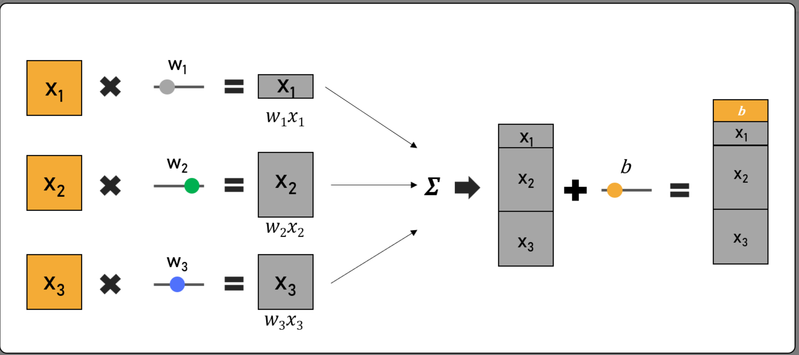
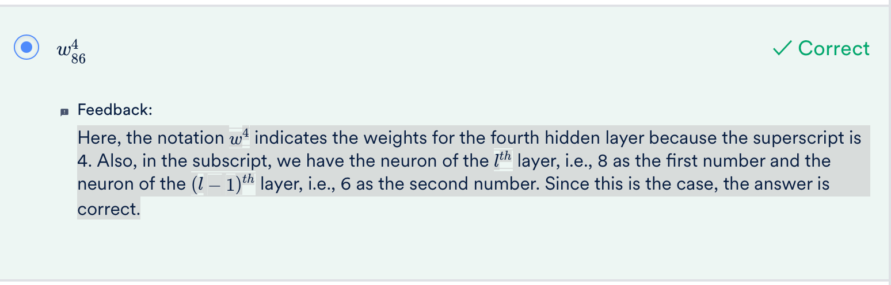
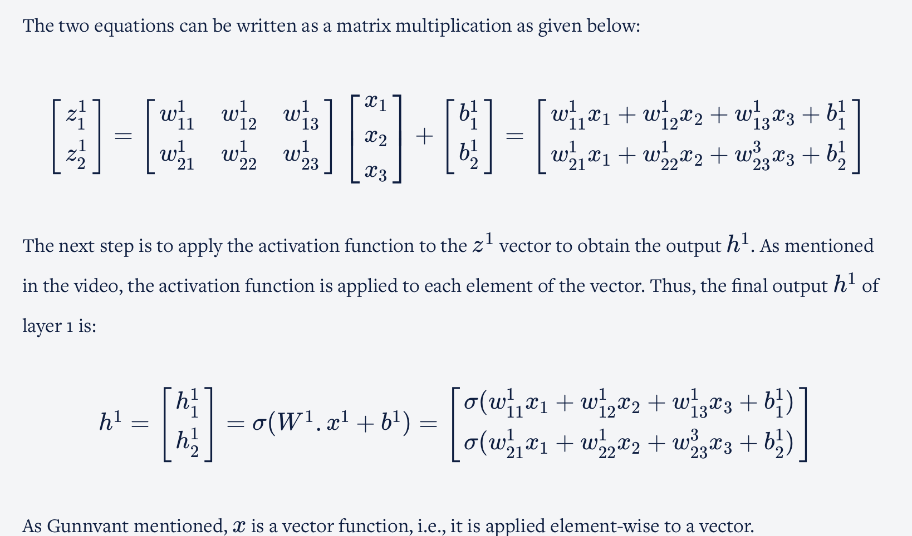
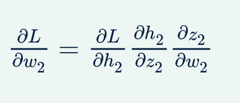
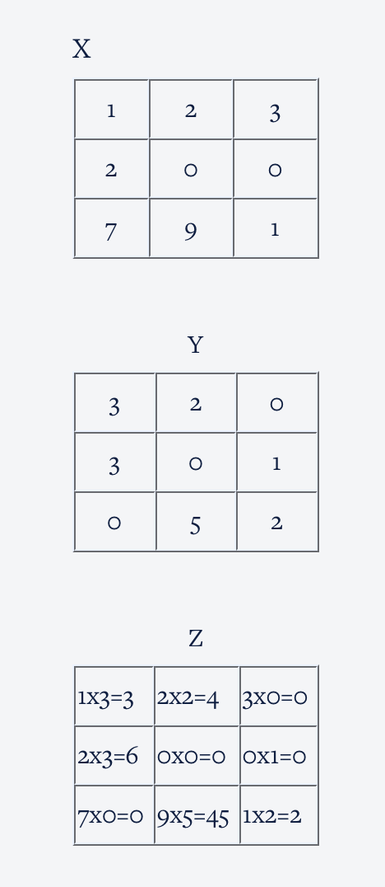
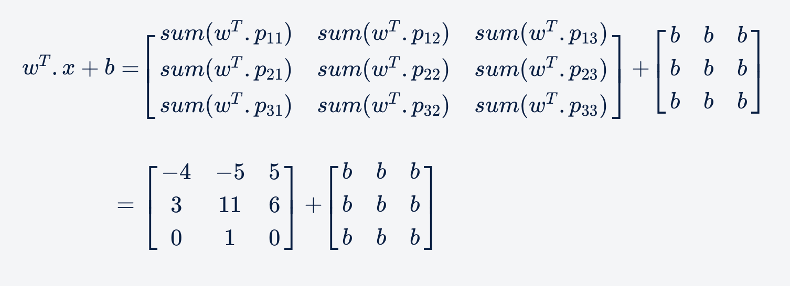

# Artificial Neural Networks

### Perceptron

A perceptron acts as a tool that enables you to make a decision based on multiple factors. Each decision factor holds a different ‘weight’. It takes a weighted sum of multiple inputs (with bias) as the cumulative input and applies an output function on the cumulative input to get the output, which then assists in making a decision.

**CumulativeInput = w1.x1 + w2.x2 + w3.x3 + b**

Where, **xi’s** represent the inputs, **wi’s** represent the weights associated with inputs and **b** represents bias.

We then apply the step function to the cumulative input. According to the step function, if this cumulative sum of inputs is greater than 0, then the output is 1/yes; or else, it is 0/no

### Artificial Nuerons

A neuron is quite similar to a perceptron. However, in perceptrons, the commonly used activation/output is the step function, whereas in the case of ANNs, the activation functions are non-linear functions.

.png)

multiple artificial neurons in a neural network are arranged in different layers. The first layer is known as the **input layer** , and the last layer is called the **output layer** . The layers in between these two are the **hidden layers**

.png)

There are six main elements that must be specified for any neural network. They are as follows:

1. Input layer
2. Output layer
3. Hidden layers
4. Network topology or structure
5. Weights and biases
6. Activation functions

### Inputs and Outputs of Nueral Network

**IMPORTANT: The inputs can only be numeric**

For different types of input data, you need to use different ways to convert the inputs into a numeric form. The most commonly used inputs for ANNs are as follows:

* **Structured data** : The type of data that we use in standard machine learning algorithms with multiple features and available in two dimensions, such that the data can be represented in a tabular format, can be used as input for training ANNs. Such data can be stored in **CSV files, MAT files, Excel files, etc** . This is highly convenient because the input to an ANN is usually given as a numeric feature vector. Such structured data eases the process of feeding the input into the ANN.
* **Text data** : For text data, you can use a **one-hot vector** **or** **word embeddings** corresponding to a certain word. For example, in one hot vector encoding, if the vocabulary size is |V|, then you can represent the word w**n** as a one-hot vector of size |V| with '1' at the nth element with all other elements being zero. The problem with one-hot representation is that, usually, the vocabulary size |V| is huge, in tens of thousands at least; hence, it is often better to use word embeddings that are a lower-dimensional representation of each word.
* **Images** : Images are naturally represented as arrays of numbers and can thus be fed into the network directly. These numbers are the **raw pixels of an image** . ‘Pixel’ is short for ‘picture element’. In images, pixels are arranged in rows and columns (an array of pixel elements).
* **Speech:** In the case of a speech/voice input, the basic input unit is in the form of **phonemes** . These are the distinct units of speech in any language. The speech signal is in the form of waves, and to convert these waves into numeric inputs, you need to use Fourier Transforms. Note that the input after conversion should be numeric, so you are able to feed it into a neural network.

Depending on the nature of the given task, the outputs of neural networks can either be in the form of classes (if it is a classification problem) or numeric (if it is a regression problem).
One of the commonly used output functions is the softmax function for classification.

A softmax output is similar to what we get from a multiclass logistic function commonly used to compute the probability of an output belonging to one of the multiple classes. It is given by the following formula:

pi=e^wix′/ ∑c−1t=o e^wt.x′

where c is the number of classes or neurons in the output layer, x′ is the input to the network, and wi’s are the weights associated with the inputs.

An in-depth representation of the cumulative input as the output is given below.

In the image above, z is the cumulative input.

z = w1.x1 + w2.x2 + w3.x3 + b

### Activation functions

The activation functions introduce non-linearity in the network, thereby enabling the network to solve highly complex problems. Problems that take the help of neural networks require the ANN to recognise complex patterns and trends in the given data set. If we do not introduce non-linearity, the output will be a linear function of the input vector. This will not help us in understanding more complex patterns present in the data set.

While choosing activation functions, you need to ensure that they are:

1. Non-linear,
2. Continuous, and
3. Monotonically increasing.

**Different types of activation functions:**

**The features of these activation functions are as follows:**

1. **Sigmoid** : When this type of function is applied, the output from the activation function is bound between 0 and 1 and is not centred around zero. A sigmoid activation function is usually used when we want to regularise the magnitude of the outputs we get from a neural network and ensure that this magnitude does not blow up.

- *Output Range*: (0,1)
- *Use Cases*:
  - Used in binary classification tasks (often in the output layer).
  - Suitable for probability-based outputs.
- *Advantages*:
  - Maps any input to a probability-like value.
- *Disadvantages*:
  - Vanishing gradient problem: Gradients become very small for large or small inputs.
  - Outputs not centered at 0, which slows optimization.

2. **Tanh (Hyperbolic Tangent)** : When this type of function is applied, the output is centred around 0 and bound between -1 and 1, unlike a sigmoid function in which case, it is centred around 0.5 and will give only positive outputs. Hence, the output is centred around zero for tanh.

- *Output Range*: (−1,1)
- *Use Cases*:
  - Captures both negative and positive activations better than sigmoid.
  - Tanh outputs values between -1 and 1, with zero being at the center.
  - This helps in faster convergence during optimization since the gradients are less skewed compared to Sigmoid
- *Advantages*:
  - Outputs are zero-centered, making optimization easier.
- *Disadvantages*:
  - Suffers from the vanishing gradient problem, though less severe than sigmoid.

3. **ReLU (Rectified Linear Unit)** : The output of this activation function is linear in nature when the input is positive and the output is zero when the input is negative. This activation function allows the network to converge very quickly, and hence, its usage is computationally efficient. However, its use in neural networks does not help the network to learn when the values are negative.

- *Output Range*: [0,∞)
- *Use Cases*:
  - Most widely used in hidden layers of deep neural networks.
  - Effective for convolutional and fully connected layers.
*Advantages*:
  - Computationally efficient (simple operation).
  - Reduces vanishing gradient problems.
- *Disadvantages*:
  - Can suffer from the dying ReLU problem, where neurons output 0 for all inputs, effectively becoming inactive.

4. **Leaky ReLU (Leaky Rectified Linear Unit)** : This activation function is similar to ReLU. However, it enables the neural network to learn even when the values are negative. When the input to the function is negative, it dampens the magnitude, i.e., the input is multiplied with an epsilon factor that is usually a number less than one. On the other hand, when the input is positive, the function is linear and gives the input value as the output. We can control the parameter to allow how much ‘learning emphasis’ should be given to the negative value.

- *Output Range*: (−∞,∞)
- *Use Cases*:
  - Overcomes the dying ReLU problem, especially in deep networks.
  - Use in hidden layers when ReLU leads to inactive neurons.
- *Advantages*:
  - Allows small gradients for negative inputs (α controls the slope).
- *Disadvantages*:
  - Choosing the right value of α can be non-trivial.

### Parameters and Hyperparameters of a Neural Network

During training, the neural network learning algorithm fits various models to the training data and selects the best prediction model. The learning algorithm is trained with a fixed set of **hyperparameters** associated with the network structure. Some of the important hyperparameters to consider to decide the network structure are given below:

* Number of layers
* Activation function
* Number of neurons in the input, hidden and output layers
* Learning rate (the step size taken each time we update the weights and biases of an ANN)
* Number of epochs (the number of times the entire training data set passes through the neural network)

The purpose of training the learning algorithm is to obtain optimum weights and biases that form the ****parameters**** of the network.

#### Terminologies

1. **W** represents the weight of the matrix
2. **b** stands for bias
3. **x** stands for input
4. **y** stands for the actual label or value that the model is trying to predict
5. **p** represents the probability vector of the predicted output for the classification problem. **h^L** represents the predicted output for the regression problem (where L represents the number of layers)

Detailed Notations

- **Layer-specific superscripts**:

  - Denote which layer the variable belongs to. For example:
    - \( h^n \): Output of the \( n \)-th hidden layer.
    - \( z^n \): Accumulated input to the \( n \)-th layer.
- **Neuron-specific subscripts**:

  - Denote the index of a specific neuron within a layer. For example:
    - \( h nto2 \): Output of the \( n \)-th neuron in the second hidden layer.
    - \( z nto3 \): Accumulated input to the third neuron in the \( n \)-th layer.
- **Weight matrix connections**:

  - \( W^2 \): Weight matrix connecting the first hidden layer to the second hidden layer.
  - \( w 31to2 \): Weight connecting the first neuron of the first hidden layer to the third neuron of the second hidden layer.
- **Bias terms**:

  - \( b 1to3 \): Bias for the third neuron in the first hidden layer.

  

### Assumputions of a Neural Network

1. The neurons in an ANN are arranged in layers, and these layers are arranged sequentially.
2. The neurons within the same layer do not interact with each other.
3. The inputs are fed into the network through the input layer, and the outputs are sent out from the output layer.
4. Neurons in consecutive layers are densely connected, i.e., all neurons in layer l are connected to all neurons in layer l+1.
   Eg: Number of interconnections = Number of neurons in layer **l** x Number of neurons in layer **(l−1)** = 11 * 18 = 198
5. Every neuron in the neural network has a bias value associated with it, and each interconnection has a weight associated with it.
6. All neurons in a particular hidden layer use the same activation function. Different hidden layers can use different activation functions, but in a hidden layer, all neurons use the same activation function.

## Feedforward Neural Network

The information flow in a neural network from the input layer to the output layer to enable the neural network to make a prediction. The information flow in this direction is often called **feedforward**.

### Algorithm

The pseudocode for a feedforward pass is given below:

1. We initialise the variable h0 as the input: h0=xi
2. We loop through each of the layers computing the corresponding output for each layer, i.e., h^l.
   For l in [1,2,......,L]: h^l=σ(W^l.h^(l−1)+b^l)
3. We compute the prediction p by applying an activation function to the output from the previous layer, i.e., we apply a function to h^L, as shown below.  p=f(h^L)

In both the regression and classification problems, the same algorithm is used till the last step.
In the final step, in the classification problem, p defines the probability vector, which gives the probability of the data point belonging to a particular class among different possible classes or categories. In the regression problem, p represents the predicted output obtained, which we will normally refer to as h^L.

For classification problem, we use **softmax output**, which gives us the probability vector pi:

> Pij = e^(wj.hL) / ∑t=1toc Wt.hL

which is basically  normalising the vector pi.

### Loss function

We want to know how wrong the prediction of the neural network is and want to quantify this error in the prediction. A loss function or cost function will help us quantify such errors.

In the case of regression, the most commonly used loss function is **MSE/RSS**.

> Loss = 1/2 * (actual-predicted)^2
>
> RSS = (actual-predicted)^2
>
> Avg.Loss = MSE = RSS*1/N

In the case of classification, the most commonly used loss function is **Cross Entropy/Log Loss**.

> Individual loss = -∑actual*log(predicted)
> Total Loss = Sum of all individual losses

The task of training neural networks is similar to that of other ML models such as linear regression and logistic regression. The predicted output (output from the last layer) minus the actual output is the cost (or the loss), and we have to tune the parameters **w and b** such that the total cost is minimised.

#### Minimization of total loss

We minimise the average of the total loss and not the total loss. Minimising the average loss implies that the total loss is getting minimised.

This can be done using any optimisation routine such as **gradient descent**.

The gradient vector is in the direction in which the loss value increases most rapidly.

The parameter being optimised is iterated in the direction of reducing cost according to the following rule:

> **W**new = **W**old - α.(∂L/∂W)
> where, W refers to the matrix of all weights and biases

## Back propagation

**Using the chain rule equation**, we can calculate the gradient of loss needed for above function

> ∂L/∂w2 = ∂L/∂h2 * ∂h2/∂z2 * ∂z2/∂w2

> **Loss function**: L = 1/2 * (y−h2)^2

#### Psuedo code

1. Initialise with the input
2. Forward propagation of the input through the network with random initial values for weights and biases
3. Making a prediction and computing the overall loss
4. Updating model parameters using backpropagation i.e., updating the weights and biases in the network, using gradient descent
5. Forward propagation of the input through the network with updated parameters leading to a decrease in the overall loss
6. Repeat the process until the optimum values of weights and biases are obtained such that the model makes acceptable predictions

## TensorFlow

TensorFlow is a deep learning library developed by **Google** . It is used widely in the industry for several different applications. Some of these applications include smart text in Gmail, Google Translate and Google Lens.

### Tensors

A tensor is the fundamental data structure used in TensorFlow. It is a multidimensional array with a uniform data type. The data type for an entire tensor is the same.

**Tensors** are n-dimensional arrays that are quite similar to NumPy arrays. An important difference between these is their performance. NumPy is a highly efficient library that is designed to work on CPUs. On the other hand, TensorFlow can work on CPUs and GPUs. So, if you have a compatible GPU, then it is highly likely that TensorFlow will outperform NumPy.

Types of Tensors:

1. tf.constant - think of const from js
2. tf.variable - think of let/var from js

The differences between these two types of tensors:

- The values of constant tensors cannot be changed once they are declared but those of variable tensors can be.
- Constant tensors need to be initialised with a value while they are being declared, whereas variable tensors can be declared later using operations.
- Differentiation is calculated for variable tensors only, and the gradient operation ignores constants while differentiating.

TensorFlow supports all the basic mathematical operators, and you can call them by simply using the respective operators. To use the operator commands, you need to ensure that both tensors on which the operations are being carried out have the same dimensions

#### Keras flow

The whole process can be summarised as follows:

1. Define a simple sequential model to set the hidden layer(s) and the output layer. The following code allows us to define the simple sequential model:

> model = keras.Sequential(
> [ keras.layers.Dense(2, activation="sigmoid", input_shape=(X.shape[-1],)),
> keras.layers.Dense(1, activation="linear")
> ])

2. Display the properties and dimensions of each layer of the neural network.

> model.summary()

3. Define the type of optimiser to update the weights and biases.

> model.compile(optimizer=keras.optimizers.SGD(), loss="mean_squared_error")

4. Fit all the components defined above into one line of code to train the neural network.

> model.fit(X,Y.values,epochs=10,batch_size=32)

5. Obtain predictions on different input data.

> model.predict(X)[:,0]

---

> model.fit(X_train, y_train, batch_size=64, epochs=5, validation_data=(X_val, y_val))

The number of **epochs** mentioned in the code snippet defines the number of times the learning algorithm will work through the entire data set. One epoch indicates that each training example has had an opportunity to update the internal model parameters, i.e., the weights and biases.

**Batch size** refers to the number of training examples utilised in one iteration. The model decides the number of examples to work with in each iteration before updating the internal model parameters.

Up to a certain batch size, most architectures use a constant memory, after which the consumption increases linearly with the batch size.

#### Dropouts

The main purpose of using dropouts is to reduce overfitting in Neural networks.
The dropout operation is performed by multiplying the weight matrix Wl with an α mask vector. The shape of the vector **α** will be (Weight columns shape,1). Now if the value of **q** (the probability of 1) is 0.66, the **α** vector will have two 1s and one 0.

You can see the differences between the ANN without dropout and the ANN with dropout below. Adding a dropout layer essentially removes the links from the third neuron in the first layer to all the neurons in the next layer. The cross on the interconnections indicates that the interconnection has been removed.

Some important points to note regarding dropouts are:

1. Dropouts can be applied only to some layers of the network (in fact, that is a common practice - you choose some layer arbitrarily to apply dropouts to)
2. The mask α is generated independently for each layer during feedforward, and the same mask is used in backpropagation
3. The mask changes with each minibatch/iteration and is randomly generated in each iteration (sampled from a Bernoulli with some p(1)=q)

> # dropping out 20% neurons in a layer in Keras
>
> model.add(Dropout(0.2))

Some important points to note while implementing dropouts are as follows:

1. Here, '0.2' is the probability of zeros and not ones.
2. This is one of the hyperparameters to be experimented with when building a neural network.
3. You do not apply dropout to the output layer.
4. The mask used here is a matrix.
5. Dropout is applied only during training, not while testing.

Dropouts also help in symmetry breaking. There is an extremely high likelihood that communities will be created within neurons, which can restrict the neurons from learning independently. Hence, by setting a random set of the weights to zero in every iteration, this community/symmetry can be broken.

#### Batch Normalisation

Batch normalisation is performed on the output of the layers of each batch, Hl. It is essentially normalising the matrix Hl across all data points in the batch. Each vector in Hl is normalised by the mean vector μ and the standard deviation vector ^σ computed across a batch.

Up to a certain batch size, most architectures use a constant memory, after which the consumption increases linearly with the batch size.

> keras.layers.BatchNormalization()

# Convolutional Neural Networks

Convolutional Neural Networks, or CNNs, are neural networks specialised to work with **visual data** , i.e. images and videos (though not restricted to them). They are very similar to the vanilla neural networks (multilayer perceptrons) - every neuron in one layer is connected to every neuron in the next layer, they follow the same general principles of forward and backpropagation, etc. However, there are certain features of CNNs that make them perform extremely well on image processing tasks.

## Some applications of CNN:

- **Object localization**: Identifying the local region of the objects (as a rectangular area) and classifying them.
- **Semantic segmentation**: Identifying the exact shapes of the objects (pixel by pixel) and classifying them.
- **Optical Character Recognition (OCR)**: Recognise characters in an image. For example, in the top-left image, the output will be ‘1680’.

Understandings from Influential Paper on [Visual system of a cat](https://www.ncbi.nlm.nih.gov/pmc/articles/PMC1363130/pdf/jphysiol01298-0128.pdfhttps:/):

- Each neuron in the retina focuses on one part of the image and that part of the image is called the **receptive field of that neuron**
- There are **excitatory and inhibitory regions** in the receptive field. The neurons only ‘fire’ when there is a **contrast between the excitatory and the inhibitory regions**. If we splash light over the excitatory and inhibitory regions together, because of no contrast between them, the neurons don’t ‘fire’ (respond). If we splash light just over the excitatory region, neurons respond because of the contrast.
- The strength of the response is proportional to the summation over only the excitatory region (not inhibitory region). (pooling layer in CNNs)
- The receptive fields of all neurons are almost identical in shape and size
- There is a hierarchy in the units: Units at the initial level do very basic tasks such as picking raw features (such as horizontal edges) in the image. The subsequent units extract more abstract features, such as identifying textures, detecting movement, etc. The layers 'higher' in the hierarchy typically aggregate the features in the lower ones.

### VGGNet Architecture

The most important point to notice is that the network acts as a feature extractor for images

There are three main concepts in CNNs:

1. Convolution, and why it 'shrinks' the size of the input image
2. Pooling layers
3. Feature maps

The VGGNet was specially designed for the ImageNet challenge which is a classification task with 1000 categories. Thus, the softmax layer at the end has 1000 categories.

- The blue layers are the convolutional layers
- The yellow ones are pooling layers
- The green layer is a fully connected layer with 4096 neurons, the output from which is a vector of size 4096.

#### Video analysis

For a video classification task, here's what we can do. Suppose the videos are of length 1 minute each. If we extract frames from each video at the rate of 2 frames per second (FPS), we will have 120 frames (or images) per video. Push each of these images into a convolutional net (such as VGGNet) and extract a feature vector (of size 4096, say) for each image. Thus, we have 120 feature vectors representing each video.

These 120 feature vectors, representing a video as a sequence of images, can now be fed sequentially into an RNN (good at processing sequential information such as videos (a sequence of images)) which classifies the videos into one of the categories.

The main point here is that a **CNN acts as a feature extractor for images**, and thus, can be used in a variety of ways to process images.

#### Convolution

Mathematically, the convolution operation is the summation of the element-wise product of two matrices.

Finally, you compute the sum of all the elements in Z to get a scalar number, i.e. 3+4+0+6+0+0+0+45+2 = 60.

This is an example of how the convolution operation (using an appropriate filter) detects certain features in images, such as horizontal or vertical edges. You basically move the filter accross the image and generate a convoluted image using element-wise product of 2 matrices.

You can do vertical edge detection like above, or horizontal detection where the filter would look something like [[1,1,1],[0,0,0],[-1,-1,-1]] or diagonal detection etc. It depends on the image and the requirements

---

**Stride** - You move the filter on the image by **x** pixel. This **x** is called as strides. There is nothing sacrosanct about the stride length 1. If you think that you do not need many fine-grained features for your task, you can use a higher stride length (2 or more).

You cannot convolve all images with just any combination of filter and stride length. For example, you cannot convolve a (4, 4) image with a (3, 3) filter using a stride of 2. Similarly, you cannot convolve a (5, 5) image with a (2, 2) filter and a stride of 2 (try and convince yourself).

To solve this problem, you use the concept of **padding**, or an alternate (less commonly used) way to do convolution is to shrink the filter size as you hit the edges.

The following are the two most common ways to do padding:

- Populating the dummy row/columns with the pixel values at the edges
- Populating the dummy row/columns with zeros (zero-padding)

Padding of 'x' means that 'x units' of rows/columns are added all around the image.

**IMPORTANT: Doing convolutions without padding reduces the output size (relative to the input which is being convolved), And if all the layers keep shrinking the output size, by the time the information flows towards the end of the network, the output would have reduced to a very small size (say 2 x 2) - which will be insufficient to store information for complex tasks.**

Size of a convoluted image matrix is given by:

> ((n+2P-k)/S) + 1, ((n+2P-k)/S) + 1
>
> (n+2P-k)/S has to be an integer; n+2P-k should be divisible by S

where:
n = image nxn
P = padding
k = filter kxk
S = stride

---

For 3d images:

- We use 3D filters to perform convolution on 3D images. For example: if we have an image of size (224, 224, 3), we can use filters of sizes (3, 3, 3), (5, 5, 3), (7, 7, 3) etc. (with appropriate padding etc.). We can use a filter of any size as long as the number of channels in the filter is the same as that in the input image.
- The filters are learnt during training (i.e. during backpropagation). Hence, the individual values of the filters are often called the weights of a CNN.
- You can express the convolution operation as a dot product between the weights (filter) and the input image
- Apart from weights each filter can also have a bias and, all the individual elements in the bias vector have the same value (called tied biases)

Given an image of size 128 x 128 x 3, a stride length of 1, padding of 1, and a kernel of size 3x3x3, the output size will be 128 x  128. Though the input and filter are now 3D, the output of convolution will still be a 2D array. This is because, in each step of the convolution, the 9 elements of the filter will be 'dot product-ed' with the 9 elements of the 3D image, giving a single scalar number as the output.

What is the total number of trainable parameters in a kernel/filter of size 3x3x3? Assume that there is a single tied bias associated with the filter.

- 28. There are 27 weights and one bias in the (3, 3, 3) filter

#### Feature Map

- A neuron is basically a filter whose weights are learnt during training. For example, a (3, 3, 3) filter (or neuron) has 27 weights. Each neuron looks at a particular region in the input (i.e. its 'receptive field').
- A feature map is a collection of multiple neurons each of which looks at different regions of the input with the same weights. All neurons in a feature map extract the same feature (but from different regions of the input). It is called a 'feature map' because it is a mapping of where a certain feature is found in the image.

##### Comprehension - Feature Maps

Consider the VGGNet architecture shown below. The first convolutional layer takes the input image of size (224, 224, 3), uses a (3, 3, 3) filter (with some padding), and produces an output of (224, 224). This (224, 224) output is then fed to a ReLU to generate a (224, 224) feature map. Note that the term 'feature map' refers to the (non-linear) output of the activation function, not what goes into the activation function (i.e. the output of the convolution).

Similarly, multiple other (224, 224) feature maps are generated using different (3, 3, 3) filters. In the case of VGGNet, 64 feature maps of size (224, 224) are generated, which are denoted in the figure below as the tensor 224 x 224 x 64. Each of the 64 feature maps try to identify certain features (such as edges, textures etc.) in the (224, 224, 3) input image.

The (224, 224, 64) tensor is the output of the first convolutional layer.  In other words, the first convolutional layer consists of 64 (3, 3, 3) filters, and hence contains 64 x 27 trainable weights (assuming there are no biases).

The 64 feature maps, or the (224, 224, 64) tensor, is then fed to a pooling layer.

#### Pooling

Pooling tries to figure out whether a particular region in the image has the feature we are interested in or not. It essentially looks at larger regions (having multiple patches) of the image and captures an aggregate statistic (max, average etc.) of each region. In other words, it makes the network invariant to local transformations.

The two most popular aggregate functions used in pooling are 'max' and 'average'. The intuition behind these are as follows:

- Max pooling: If any one of the patches says something strongly about the presence of a certain feature, then the pooling layer counts that feature as 'detected'.
- Average pooling: If one patch says something very firmly but the other ones disagree,  the pooling layer takes the average to find out.

Pooling has the advantage of making the representation more compact by reducing the spatial size (height and width) of the feature maps, thereby reducing the number of parameters to be learnt. On the other hand, it also loses a lot of information, which is often considered a potential disadvantage. Having said that, pooling has empirically proven to improve the performance of most deep CNNs.

To summarise, a typical CNN layer (or unit) involves the following two components in sequence:

- We have an input image which is convolved using multiple filters to create multiple feature maps
- Each feature map, of size (c, c), is pooled to generate a (c/2, c/2) output (for a standard 2 x 2 pooling).

The above pattern is called a CNN layer or unit. Multiple such CNN layers are stacked on top of one another to create deep CNN networks.

### Experiments on cifar10

1. Experiment - I (Use dropouts after conv and FC layers, no Batch Normalization):
   Training accuracy =  84%, validation accuracy  =  79%
2. Experiment - II (Remove dropouts from conv layers, retain dropouts in FC, use Batch Normalization):
   Training accuracy =  98%, validation accuracy  =  79%
3. Experiment - III (Use dropouts after conv and FC layers, use Batch Normalization):
   Training accuracy =  89%, validation accuracy  =  82%
4. Experiment - IV (Remove dropouts from conv layers, use L2 + dropouts in FC, use Batch Normalization):
   Training accuracy = 94%, validation accuracy = 76%.
5. Experiment-V: Dropouts after conv layer, L2 in FC, use BN after convolutional layer
   Train accuracy =  86%, validation accuracy = 83%
6. Experiment-VI: Add a new convolutional layer to the network
   Train accuracy =  89%, validation accuracy = 84%
7. Experiment-VII: Add more feature maps to the convolutional layers to the network
   Train accuracy =  92%, validation accuracy = 84%

## CNN Architectures

The **depth** of the state-of-the-art neural networks has been **steadily increasing** (from AlexNet with 8 layers to ResNet with 152 layers).

### AlexNet and VGGNet

Alex net Paper: https://proceedings.neurips.cc/paper_files/paper/2012/file/c399862d3b9d6b76c8436e924a68c45b-Paper.pdf

VGGNet Paper: http://arxiv.org/pdf/1409.1556

The AlexNet was one of the very first architectures to achieve extraordinary results in the ImageNet competition (with about a 17% error rate). It had used 8 layers (5 convolutional and 3 fully connected). One distinct feature of AlexNet was that it had used various kernels of large sizes such as (11, 11), (5, 5), etc. Also, AlexNet was the first to use dropouts, which were quite recent back then.

The key idea in moving from AlexNet to VGGNet was to **increase the depth** of the network by using **smaller filters**

We say that the stack of two (3, 3) filters has the same **effective receptive field** as that of one (5, 5) filter.  This is because both these convolutions produce the same output (of size 1 x 1 here) whose receptive field is the same 5 x 5 image.

### GoogleNet

Paper: https://arxiv.org/pdf/1409.4842

Unlike the previous innovations, which had tried to increase the model capacity by adding more layers, reducing the filter size etc. (such as from AlexNet to VGGNet), GoogleNet had increased the depth using a new type of convolution technique using the **Inception module**.

Some important features of the GoogleNet architecture are as follows:

* Inception modules stacked on top of each other, total 22 layers
* Use of 1 x 1 convolutions in the modules
* Parallel convolutions by multiple filters (1x1, 3x3, 5x5)
* Pooling operation of size (3x3)
* No FC layer, except for the last softmax layer for classification
* Number of parameters reduced from 60 million (AlexNet) to 4 million

### Residual Net

Research Paper: https://arxiv.org/pdf/1512.03385

The key motivator for the ResNet architecture was the observation that, empirically, adding more layers was not improving the results monotonically.  This was counterintuitive because a network with n + 1 layers should be able to learn *at least* what a network with n layers could learn, plus something more.

The ResNet team [(Kaiming He et al) came up with a novel architecture ](https://arxiv.org/pdf/1512.03385.pdf)with skip connections  which enabled them to train networks as deep as 152 layers . The ResNet achieved groundbreaking results across several competitions - a 3.57% error rate on the ImageNet and the first position in many other ILSVRC and [COCO object detection](http://cocodataset.org/#home) competitions.

The **skip connection mechanism** was the key feature of the ResNet which enabled the training of very deep networks. Some other key features of the ResNet are summarised below:

* ILSVRC’15 classification winner (3.57% top 5 error)
* 152 layer model for ImageNet
* Has other variants also (with 35, 50, 101 layers)
* Every 'residual block' has two 3x3 convolution layers
* No FC layer, except one last 1000 FC softmax layer for classification
* Global average pooling layer after the last convolution
* Batch Normalization after every convolution layer
* SGD + momentum (0.9)
* No dropout used

### Transfer learning

Transfer learning is the practice of reusing the skills learnt from solving one problem to learn to solve a new, related problem.

Some practical reasons to use transfer learning are as follows:

- Data abundance in one task and data crunch in another related task,
- Enough data available for training, but lack of computational resources.

An example of the first case is this - say you want to build a model (to be used in a driverless car to be driven in India) to classify 'objects' such as a pedestrian, a tree, a traffic signal, etc. Now, let's say you don't have enough labelled training data from Indian roads, but you can find a similar dataset from an American city. You can try training the model on the American dataset, take those learned weights, and then train further on the smaller Indian dataset.

Examples of the second use case are more common - say you want to train a model to classify 1000 classes, but don't have the infrastructure required. You can simply pick up a trained VGG or ResNet and train it a little more on your limited infrastructure

Here's an example of document summarisation. If you want to do document summarisation in some other language, such as Hindi, you can take the following steps:

- Use word embeddings in English to train a document summarisation model (assuming a significant amount of data in English is available)
- Use word embeddings of another language such as Hindi (where you have a data crunch) to tune the English summarisation model

---

The initial layers of a network extract the basic features, the latter layers extract more abstract features, while the last few layers are simply discriminating between images.

In other words, the initial few layers are able to **extract generic representations** of an image and thus can be used for any general image-based task. So you take initial layers of VGGNet/AlexNet/GoogleNet/ResNet which can extract generic representations of an image remove their discrimination layer and add your own discrimination layers based on your use case.

Thus, you have the following two ways of training a pre-trained network:

1. ‘**Freeze**’ the initial layers, i.e. use the same weights and biases that the network has learnt from some other task, remove the few last layers of the pre-trained model, add your own new layer(s) at the end and **train only the newly added layer(s).**
2. **Retrain** all the weights **starting (initialising) from the weights and biases** that the net has already learnt. Since you don't want to unlearn a large fraction of what the pre-trained layers have learnt. So, for the initial layers, we will choose a low learning rate.

### Comparison on popular architectures

Research paper: https://arxiv.org/pdf/1605.07678

This paper compares the popular architectures on multiple metrics related to resource utilisation such as accuracy, memory footprint, number of parameters, operations count, inference time and power consumption

* Architectures in a particular cluster, such as** ****GoogleNet, ResNet-18 and ENet,**** **are very attractive since they have** ****small footprints** **** (both memory and time) as well as pretty good accuracies. Because of low-memory footprints, they can be used on** ****mobile devices,** **** and because the number of operations is small, they can also be used in** ****real time inference** .
* In some ResNet variants (ResNet-34,50,101,152) and Inception models (Inception-v3,v4), there is a** ****trade-off** between model accuracy and efficiency, i.e. the inference time and memory requirement.
* There is a** ****marginal decrease**** **in the (forward) inference time per image with the batch size. Thus, it might not be a bad idea to use a large batch size if you need to.
* Up to a certain batch size, most architectures use a constant memory, after which the consumption increases linearly with the batch size.

# Recurrent Neural Networks

RNNs are specially designed to work with sequential data, i.e. data where there is a natural notion of a 'sequence' such as text (sequences of words, sentences etc.), videos (sequences of images), speech etc. RNNs have been able to produce state-of-the-art results in fields such as natural language processing, computer vision, and time series analysis.

Recurrent neural networks are variants of the vanilla neural networks which are tailored to learn sequential patterns

Few use cases:

- Natural Language processing
  - RNNs have given, and continue to give, state-of-the-art results in areas such as machine translation, sentiment analysis, question answering systems, speech recognition, text summarization, text generation, conversational agents, handwriting analysis and numerous other areas.
- In computer vision, RNNs are being used in tandem with CNNs in applications such as image and video processing.
- auto-reply feature which you see in many chat applications
- Auto subtitles in youtube
  - automatic speech recognition (ASR)
- chatbots
- generating music using RNNs
  - Jukebox
- Although sorting is a problem that involves an algorithm, but the fact that RNNs can learn an algorithm speaks volume about their capacity to solve hard learning problems

---

We’ll use a slightly different notation for the activation - rather than using **h** for the outputs (or activations) of a layer, we will use **a**. Thus, the feedforward equations become:

> z^l = W^l.a^(l−1) + b^l
> a^l = f^l.(z^l)
>
> a^l is not a raised l to but rather a with superscript l or l over a

The main difference between normal neural nets and RNNs is that RNNs have two 'dimensions' - time **t** (i.e. along the sequence length) and the depth **l** (the usual layers). The basic notation itself changes from **al** to **alt**. In fact, in RNNs it is somewhat incomplete to say '*the output at layer* **l**'; we rather say '*the output at layer  **l** and time **t**' .*

One way to think about RNNs is that the network changes its **state** with time (as it sees new words in a sentence, new frames in a video etc.). For e.g. we say that the state of **alt** changes to **alt+1** as it sees the next element in the sequence (word, image etc.)

Thus, the output of layer **l** at time **t+1**, **alt+1**, depends on two things:

1. The output of the previous layer at the same time step **al-1t+1** (this is the ***depth*** dimension).
2. Its own previous state **al** to **alt** (this is the ***time*** dimension)

In other words, **alt+1** is a function of **al-1t+1** and **alt**:

> alt+1 =g(al-1t+1,alt)

> alt+1 = σ(WF.al-1t+1 + WR.alt + bl)

The WF are called the **feedforward weights**.
The WR are called the **recurrent weights**.

We say that there is a recurrent relationship between **alt+1** and it's previous state **alt** and hence the name **Recurrent Neural Networks**.

## Architecture of RNN

The **green layer** is the **input layer** in which the xi's are elements in a sequence - words of a sentence, frames of a video, etc.

The layers in **red** are the **'recurrent layers'** - they represent the various states evolving over time as new inputs are seen by the network.

The **blue layer** is the output layer where the yi's are the outputs emitted by the network at each time step.

You can see that the layers of an RNN are similar to the vanilla neural nets (MLPs) - each layer has some neurons and is interconnected to the previous and the next layers. The only difference is that now each layer has a copy of itself along the time dimension (the various states of a layer, shown in red colour).  Thus, the layers along the time dimension have the same number of neurons (since they represent the various states of same lth layer over time).

<mark style="background-color: lightblue">
The flow of information in RNNs is as follows:

Each layer gets the input from two directions -  activations from the previous layer at the current timestep and activations from the current layer at the previous timestep.

Similarly, the activations (outputs from each layer) go in two directions - towards the next layer at the current timestep (through **WF**), and towards the next timestep in the same layer (through **WR**).
</mark>

### Matrix dimension

### Types of RNNs

- Many-to-One RNN

In this architecture, the input is a sequence while the output is a single element. You check at the end of a sentence whether it is grammatically correct/incorrect.

- Many-to-many RNN: Equal input and output length

In this type of RNN, the input (X) and output (Y) both are a sequence of multiple entities spread over timesteps. This architecture is used to build a **part-of-speech tagger** where each word in the input sequence is tagged with its part-of-speech at every timestep.

- Many-to-many RNN: Unequal input and output lengths

There are many problems where the lengths of the input and output sequences are different. For example, consider the task of machine translation - the length of a Hindi sentence can be different from the corresponding English sentence.

- Encoder-Decoder Architecture

The below architecture comprises of two components - an encoder and a decoder both of which are RNNs themselves. The output of the encoder, called the **encoded vector** (and sometimes also the '**context vector** '), captures a representation of the input sequence. The encoded vector is then fed to the decoder RNN which produces the output sequence.

---

In a many-to-one architecture (such as classifying a sentence as correct/incorrect), the loss is simply the difference between the predicted and the actual label. The loss is computed and backpropagated after the entire sequence has been digested by the network.

> Loss = cross - entropy(yout, y)

assuming cross-entropy is the loss function

On the other hand, in a many-to-many architecture, the network emits an output at multiple time steps, and the loss is calculated at each time step. The total loss (= the sum of the losses at each time step) is propagated back into the network after the entire sequence has been ingested.

> Loss = ∑T2i=1cross-entropy(y'i, yi)

We can now add the losses for all the sequences (i.e. for a batch of input sequences) and backpropagate the total loss into the network.

---

- One-to-many RNN

In this type of RNN, the input is a single entity, and output consists of a sequence.
This type of architecture is generally used as a **generative model**. Among popular use of this architecture are applications such as generating music (given a genre, for example), generating landscape images given a keyword, generating text given an instruction/topic, etc.

### Variants of RNNs

### Bidirectional RNNs

There are two types of sequences:

- Online sequence: Here, you don’t have access to the entire sequence before you start processing it. The network has to make predictions as it sees each input coming in.
- Offline sequence: The entire sequence is available before you start processing it.

A bidirectional RNN can only be applied to *offline sequences*.

In offline sequence, you have access to the whole sequence, so you can send a combination of first and last word in a sequence and next would be second and second last word in next sequence. Hence the network will always have visibility of future texts in the sequence. The number of inputs doubles. This is bidirectional RNN.

By using bidirectional RNNs, it is almost certain that you’ll get better results. However, bidirectional RNNs take almost double the time to train since the number of parameters of the network increase. Therefore, you have a tradeoff between training time and performance. The decision to use a bidirectional RNN depends on the computing resources that you have and the performance you are aiming for.

### Problems with RNNs

In the case of RNNs, the main problem is the **vanishing gradients problem** because the chain of gradient dependencies becomes too huge as the network is too huge. The gradients vanish before reaching the initial layers during back propagation, hence no learnings happen on the initial layers.

### LSTMs

To solve the vanishing gradients problem, many attempts have been made to tweak the vanilla RNNs such that the gradients don’t die when sequences get long. The most popular and successful of these attempts has been the **long, short-term memory network**, or the **LSTM**. LSTMs have proven to be so effective that they have almost replaced vanilla RNNs.

The main drastic improvement that LSTMs have brought is because of a novel change in the structure of a neuron itself. In the case of LSTMs, the neurons are called **cells**, and an LSTM cell is different from a normal neuron in many ways.

One of the fundamental differences between an RNN and an LSTM is that an LSTM has an **explicit memory unit** which stores information relevant for learning some task. In the standard RNN, the only way the network remembers past information is through updating the hidden states over time, but it does not have an explicit memory to store information.

On the other hand, in LSTMs, the memory units retain pieces of information even when the sequences get really long

Research paper: https://arxiv.org/pdf/1303.5778.pdf

#### Characteristics of a LSTM

- 'Cell state' or an explicit memory
- Gating mechanishm
  - Gating mechanisms regulate the information that the network stores (and passes on to the next layer) or forgets.
- Constant error carousel
  - It allows an LSTM network to have a smooth and uninterrupted flow of gradients while backpropagating

#### Structure of a LSTM cell

An LSTM cell is analogous to a neuron in an RNN - each LSTM layer contains multiple LSTM cells.

The cell receives the following inputs:

- The output of the previous time step ht-1 (a vector)
- The current input  xt (a vector)
- The previous cell state ct-1 (usually a vector)

The cell produces two outputs:

- The current cell state ct (a scalar)
- The current state output ht (a scalar)

Output of a sigmoid lies in between 0 and 1 while the output of tanh lies between -1 and 1

The three gating mechanisms - the forget gate, the update gate and the output gate.

- **Forget gate**: This gate controls how much information needs to be discarded from the previous cell state (ct-1) depending on the new input
- **Update gate**: This gate makes an update to the previous the cell state by writing a new piece of information to it
  The new cell state ct is the cumulative result of the information discarded from ct-1 by the forget gate and the new information freshly updated to ct-1 by the update gate.
- **Output gate**: This gate controls how much information needs to be passed on to the next LSTM layer based on the current cell state.

The sigmoid function decides how much information to write to the new cell state (forget gate), while the tanh decides whether to increase or decrease the value of the next cell state.(update gate)

An LSTM layer has **4x parameters** as compared to a normal RNN layer. The increased number of parameters leads to increased computational costs. For the same reason, an LSTM is more likely to overfit the training data than a normal RNN.

### GRU

Keeping in mind the computational expenses and the problem of overfitting, researchers have tried to come up with alternate structures of the LSTM cell. The most popular one of these alternatives is the **gated recurrent unit (GRU)** which was introduced in late 2014

It is a leaner version of a LSTMs
