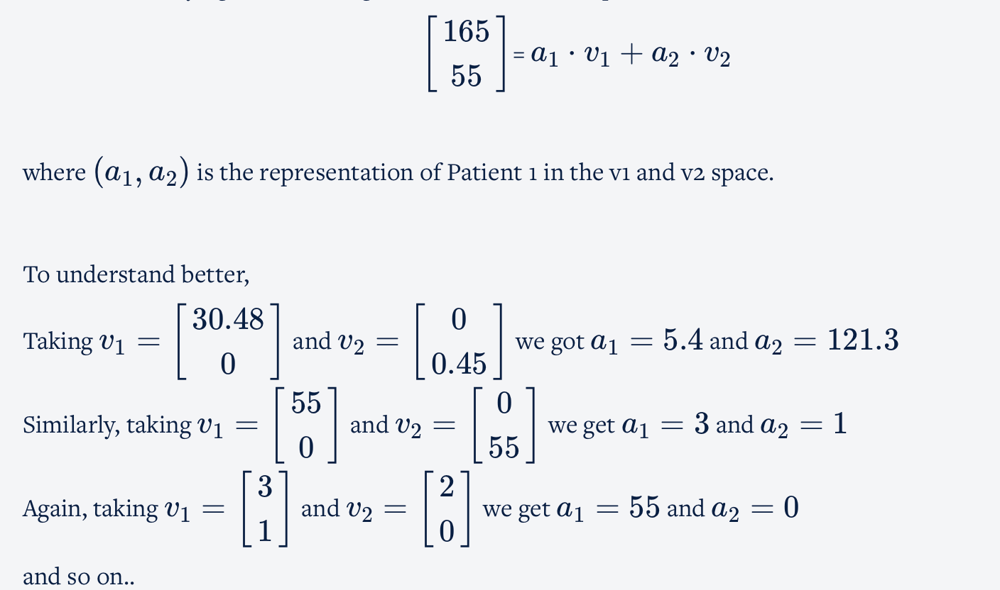

## **Introduction**

**Principal component analysis** (PCA) is one of the most commonly used dimensionality reduction techniques in the industry. By converting large data sets into smaller ones containing fewer variables, it helps in improving model performance, visualising complex data sets, and in many more areas.

Fundamentally, PCA is a dimensionality reduction technique, i.e., it approximates the original data set to a smaller one containing fewer dimensions(Note **that** ***dimension is just another term for referring to columns or variables in a dataset*** ).

This simple manipulation helps in several ways such as follows:

* For data visualisation and EDA
* For creating uncorrelated features that can be input to a prediction model:  With a smaller number of uncorrelated features, the modelling process is faster and more stable as well.
* Finding latent themes in the data: If you have a data set containing the ratings given to different movies by Netflix users, PCA would be able to find latent themes like genre and, consequently, the ratings that users give to a particular genre.
* Noise reduction

## Definition

PCA is a statistical procedure to convert observations of possibly correlated variables to ‘principal components’ such that:

* They are **uncorrelated** with each other.
* They are **linear combinations** of the original variables.
* They help in capturing maximum **information** in the data set.

## Fundamentals of PCA-1

**Vectors have a direction and magnitude**

Each vector has a direction and magnitude associated with it. The direction is given by an arrow starting from the origin and pointing towards the vector's position. The magnitude is given by taking a sum of squares of all the coordinates of that vector and then taking its square root.

**Vector Addition**

When you add two or more vectors, we essentially add their corresponding values element-wise. The first elements of both the vectors get added, the second element of both get added, and so on.

**Scalar Multiplication**

If you multiply any real number or scalar by a vector, then there is a change in the magnitude of the vector and the direction remains same or turns completely opposite depending on whether the value is positive or negative respectively.

**Matrix Multiplication**

**Identity matrix**

[[1,0],[0,1]]

In matrix notation, it serves the same function as that of the number 1 in the real number system

In the matrix world, if you have two matrices A and B, and their multiplication results in the identity matrix I, i.e.

**B**  x **A** = I, then A and B are called **inverses** of each other.

The inverse of **A** is also written as **A^**−**1**.  Therefore **B**=**A^**−**1**

A*A^-1 = I

### Basis

Essentially, ‘basis’ is a unit in which we express the vectors of a matrix.

A vector A (2,3) can be written as 2⋅[[1,0]] + 3⋅[[0,1]]. In order to obtain the vector A, we scaled i by 2 and j by 3 and then finally added them up.

This scaling and adding the vectors up to obtain a new vector is also known as a **linear combination.**

### Standard Basis vs Non Standard Basis

#### Formula to remember:

Here think of v1 as 165 and B1 as 1lbs, v2 as 74.84 and B2 as kgs
1. v1* B1 = v2 * B2

Here, think of M as how much lbs is a multiple of kgs
2. v2 = M * v1

Derived formula,

M = B2^-1 * B1

## PCA

* PCA finds new basis vectors for us. These new basis vectors are also known as Principal Components.
* We represent the data using these new Principal Components by performing the change of basis calculations.
* After doing the change of basis, we can perform dimensionality reduction. In fact, PCA finds new basis vectors in such a way that it becomes easier for us to discard a few of the features.

**WITH PCA**

### Variance

Previously, we have already learnt certain methods through which you delete columns – by checking the number of null values, unnecessary information and in modelling by checking the p-values and VIF scores.

PCA gauges the importance of a column by another metric called ‘ **variance** ’ or how varied a column’s values are.

When the variances are unequally distributed among the original features or columns i.e. some columns have much less variance than others, it is easier to remove those columns and do dimensionality reduction

But what if both axis/columns have equal variance. PCA can change the basis vectors in such a way that the new basis vectors capture the maximum variance or information.

### Steps of PCA for finding the principal components

* First, it finds the basis vector which is along the **best- fit line** that **maximises the variance**. This is our first **principal component or PC1.**
* The second principal component is perpendicular to the first principal component and contains the next highest amount of variance in the dataset.
* This process continues iteratively, i.e. each new principal component is perpendicular to all the previous principal components and should explain the next highest amount of variance.
* If the dataset contains *****n*** independent features, then PCA will create** ***n*** Principal components.

Also, once the Principal Components are found out, PCA assigns a %age variance to each PC. Essentially it's the fraction of the total variance of the dataset explained by a particular PC. This helps in understanding which Principal Component is more important than the other and by how much.

#### Summary

PCA's role in the ML pipeline almost solely exists as a dimensionality reduction tool. Basically, you choose a fixed number of PCs that explained a certain threshold of variance that you have chosen and then use only that many columns to represent the original dataset. This modified dataset is then passed on to the ML pipeline for further prediction algorithms to take place. PCA helps us in improving the model performance significantly and helps us in visualising higher-dimensional datasets as well.

#### Some important points to remember while using PCA

* Most software packages use SVD to compute the principal components and assume that the data is **scaled and** **centred,** so it is important to do standardisation/normalisation.
* PCA is a linear transformation method and works well in tandem with linear models such as linear regression, logistic regression, etc., though it can be used for computational efficiency with non-linear models as well.
* It should not be used forcefully to reduce dimensionality (when the features are not correlated).

#### Some important shortcomings of PCA:

* PCA is limited to linearity, though we can use non-linear techniques such as t-SNE as well
* PCA needs the components to be perpendicular, though in some cases, that may not be the best solution. The alternative technique is to use Independent Components Analysis.
* PCA assumes that columns with low variance are not useful, which might not be true in prediction setups (especially classification problem with a high class imbalance).
