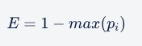
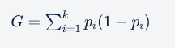
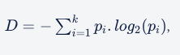
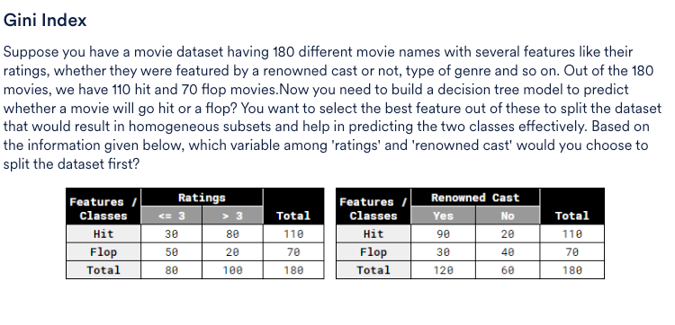
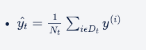
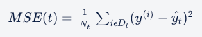

## Building decision trees

1. Recursive binary splitting/partitioning the data into smaller subsets
2. Selecting the best rule from a variable/ attribute for the split
3. Applying the split based on the rules obtained from the attributes
4. Repeating the process for the subsets obtained
5. Continuing the process until the stopping criterion is reached
6. Assigning the majority class/average value as the prediction

The decision tree building process is a **top-down** approach. The top-down approach refers to the process of starting from the top with the whole data and gradually splitting the data into smaller subsets.

The reason we call the process **greedy** is because it does not take into account what will happen in the next two or three steps

---

The advantages of tree models one by one in the following order:

* Predictions made by a decision tree are easily  **interpretable** .
* A decision tree is **versatile** in nature. It does not assume anything specific about the nature of the attributes in a data set. It can seamlessly handle all kinds of data such as numeric, categorical, strings, Boolean, etc.
* A decision tree is  **scale-invariant** . It does not require normalisation, as it only has to compare the values within an attribute, and it handles multicollinearity better.
* Decision trees often give us an idea of the relative **importance** of the explanatory attributes that are used for prediction.
* They are highly **efficient** and **fast** algorithms.
* They can **identify complex relationships** and work well in certain cases where you cannot fit a single linear relationship between the target and feature variables. This is where regression with decision trees comes into the picture.

## Algorithms for Decision Tree Construction

### Splitting and Homogeneity

We split the data in a way that results in a homogenous subset is much more desirable than the one that results in a 50-50 distribution (in the case of two labels).

In a completely homogenous set, all the data points belong to one particular label. Hence, you must try to generate partitions that result in such sets.

For classification purposes, a data set is completely homogeneous if it contains only a single class label.

For regression purposes, a data set is completely homogeneous if its variance is as small as possible

Consider a data set ‘D’ with **homogeneity ‘H’** and a defined **threshold** value. When homogeneity exceeds the threshold value, you need to stop splitting the node and assign the prediction to it. As this node does not need further splitting, it becomes the leaf node.

### Impurity Measures

You have narrowed down the decision tree construction problem to this: you want to split the data set such that the homogeneity of the resultant partitions is maximum. But how do you measure this homogeneity?

For below, i = no of classes

* Classification error

  
* Gini index

  
* Entropy

  

| **Impurity Measures**    | **Case I**Class 0: 20Class 1: 80 | **Case II**Class 0: 50Class 1: 50 | **Case III**Class 0: 80Class 1: 20 |
| ------------------------------ | -------------------------------------- | --------------------------------------- | ---------------------------------------- |
| **Classification Error** | 0.2                                    | 0.5                                     | 0.2                                      |
| **Gini Impurity**        | 0.32                                   | 0.5                                     | 0.32                                     |
| **Entropy**              | 0.72                                   | 1                                       | 0.72                                     |

The **change in impurity** or the **purity gain** is given by the difference of impurity post-split from impurity pre-split, i.e.,

**Δ Impurity = Impurity (pre-split) – Impurity (post-split)**

The **post-split impurity** is calculated by finding the  **weighted average of two child nodes** . The split that results in **maximum gain** is chosen as the  **best split** .

### Steps to decide attribute for splitting

1. Calculate the Gini impurity before any split on the whole dataset.
2. Consider any one of the available attributes.
3. Calculate the Gini impurity after splitting on this attribute for each of the levels of the attribute.
4. Combine the Gini impurities of all the levels to get the Gini impurity of the overall attribute.
5. Repeat steps 2-5 with another attribute till you have exhausted all of them.
6. Compare the decrease in Gini impurity across all attributes and select the one **which offers maximum reduction**.

You can also perform the same exercise using Entropy instead of Gini index as your measure.

#### Gini Index Problem

**Solution:**

Hit=110=110/180=0.61

Flop=70=70/180=0.39

Gini=0.61*0.39+0.39*0.61=0.4758

---

Split based on Ratings

<=3

Hit=30=30/80=0.375

Flop=50=50/80=0.625

GINI=0.375*0.625*2=0.46875

=>3

Hit=80=0.8

Flop=20=0.2

Gini=0.8*0.2*2=0.32

Total Gini=0.46875x*80/180+0.32x*100/180

=0.386

Delta Gini = 0.4758-0.386=0.0898

---

Split based on "Renowned Cast"

Yes

Hit=90=90/120=0.75

Flop=30=30/120=0.25

Gini=0.75*0.25*2=0.375

No

Hit=20=20/60=0.33

Flop=40=40/60=0.67

Gini=0.67*0.33*2=0.4422

Total Gini=0.375x120/180 + 0.4422x60/180

=0.3974

Delta Gini=0.4758-0.3974=0.0784

----- Do split by "Rating" as it has the highest delta Gini

The feature that results in a  **significant reduction in the impurity is the important variable** , and the one that results in  **less impurity reduction is the less important variable** .

## Hyperparameter tuning in decision trees

Disadvantages of decision trees:

* They tend to **overfit** the data. If allowed to grow with no check on its complexity, a decision tree will keep splitting until it has correctly classified (or rather, mugged up) all the data points in the training set.
* They tend to be quite  **unstable** , which is an implication of overfitting. A few changes in the data can considerably change a tree.

### Controlling overfitting in decision trees

There are two ways to control overfitting in trees:

1. **Truncation** - Stop the tree while it is still growing so that it may not end up with leaves containing very few data points. Note that truncation is also known as  **pre-pruning** .
2. **Pruning** - Let the tree grow to any complexity. Then, cut the branches of the tree in a bottom-up fashion, starting from the leaves. It is more common to use pruning strategies to avoid overfitting in practical implementations.

#### Methods of truncation

Though there are various ways to truncate or prune trees, the DecisionTreeClassifier() function in sklearn provides the following hyperparameters which you can control:

1. criterion (Gini or entropy)
2. max_features
3. max_depth
4. min_samples_split
5. min_samples_leaf

#### More on Pruning

In pruning, you chop off the tree branches; this results in a  **decrease in tree complexity** . It also helps in  **reducing overfitting** .

**How do you decide if a branch should be pruned or not?**

You take a tree, look at every node, try pruning it, check if accurracy dropped on validation set, and if the accuracy doesn't drop from the original accuracy then pruning worked. Keep doing it till you can without affecting the accuracy of the model significantly

### Choosing Tree Hyperparameters

Check out the section **Hyperparameter tuning using Grid Search CV to do K-fold validation** in the Heart Prediction Jupyter notebook

## Decision tree regression

In decision tree regression, each leaf represents the average of all the values as the prediction as opposed to taking an majority vote in classification trees. This **average** is calculated using the following formula:

This is nothing but the sum of all data points divided by the total number of data points.

Also, the **impurity measure** for a given node is measured by the  **weighted mean square error (WMSE)** , also known as **variance** , which is calculated by the following formula:

This is nothing but the variance of all data points.

A higher value of MSE means that the data values are dispersed widely around mean, and a lower value of MSE means that the data values are dispersed closely around mean and this is usually the preferred case while building a regression tree.

### Regression Tree building process

The regression tree building process can be summarised as follows:

1. Calculate the MSE of the target variable.
2. Split the data set based on different rules obtained from the attributes and calculate the MSE for each of these nodes.
3. The resulting MSE is subtracted from the MSE before the split. This result is called the  **MSE reduction** .
4. The attribute with the largest MSE reduction is chosen for the decision node.
5. The dataset is divided based on the values of the selected attribute. This process is run recursively on the non-leaf branches, until you get significantly low MSE and the node becomes as homogeneous as possible.
6. Finally, when no further splitting is required, assign this as the leaf node and calculate the average as the final prediction when the number of instances is more than one at a leaf node.

As you can see, the process is surprisingly similar to what you did for **classification** using trees.
